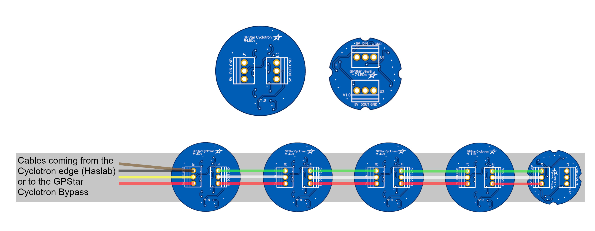
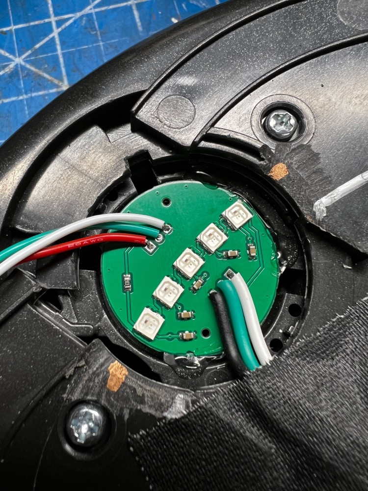
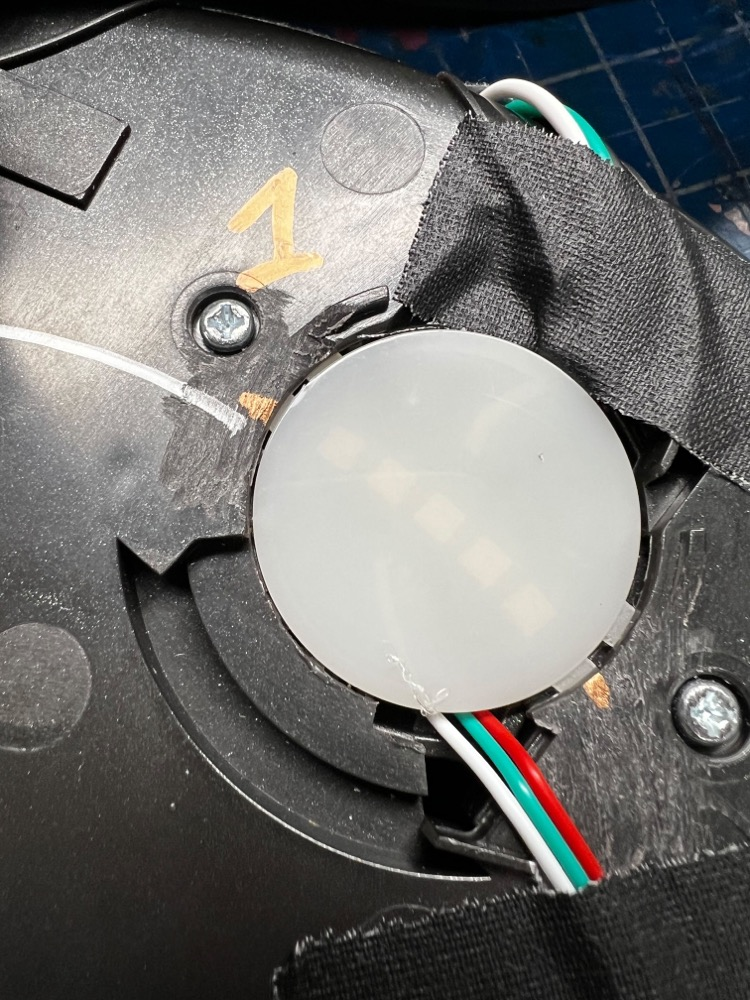
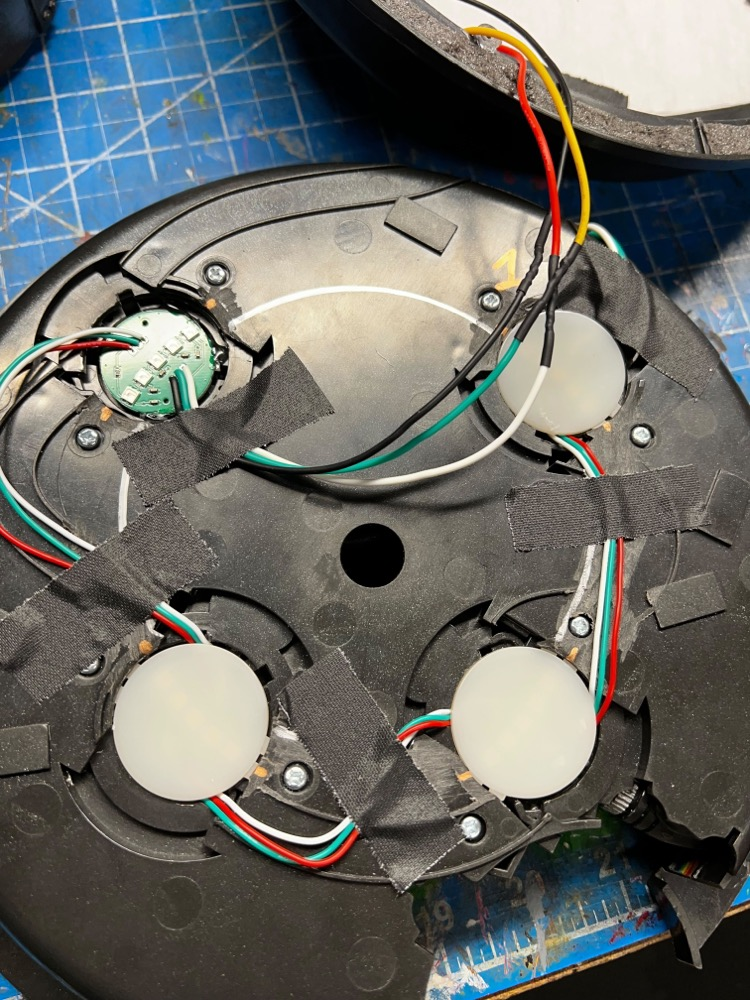
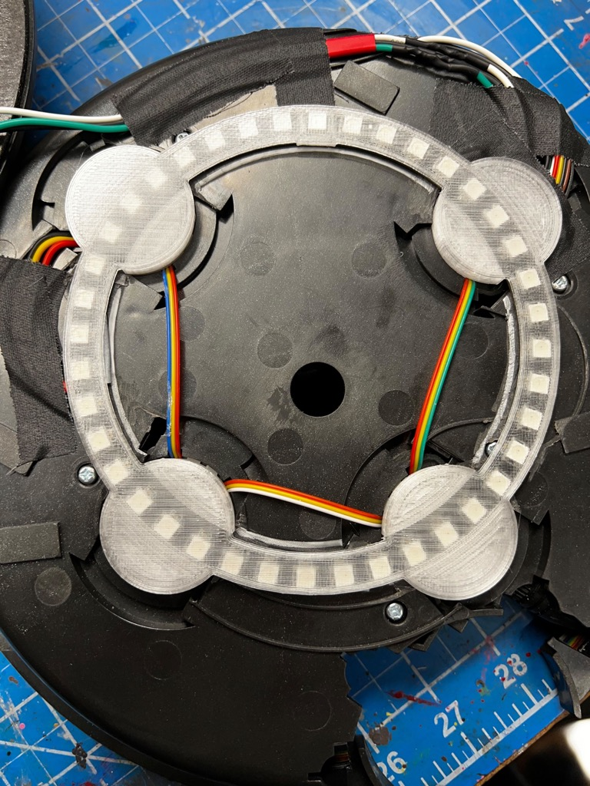

# Cyclotron Lid Lights

These are *OPTIONAL* add-on additions for use within the Proton Pack.

## Cyclotron Lid Lights (Optional)

The stock lights in the HasLab pack only supplies 12 addressable LEDs which are red-only. If you wish to be able to change the colours of these lights you will need to replace them with an addressable LED ring, [GPStar Cyclotron LEDs](https://gpstartechnologies.com/products/gpstar-cyclotron) or those made by Frutto Technology such as the [20-LED (4x 5-LED)](https://fruttotechnology.com/ols/products/cyclotron-5-leds-kit) or [36-LED (4x 9-LED)](https://fruttotechnology.com/ols/products/cyclotron-5-leds-kit-cyc-5-lds-kit1) option.

Regardless of solution you will need to split apart the Cyclotron Lid which is secured at 6 locations around the lid. Gently prying under the plastic near the N-Filter on the inside of the lid will be the first screw posts cold-welded to the lid. A firm but slow twist should break the bond and begin to separate the halves. To re-secure, the best option is to drill through the center of each obvious cold weld on the inner lid and use small screws to attach the halves back together.

## Haslab Proton Pack Hookup Guide

## DIY and Spirit Packs Hookup Guide

## Installation Guide Video

[GPStar Proton Pack & Neutrona Wand Cyclotron Lights Installation Video](https://www.youtube.com/watch?v=A5eP50iO5qc) (YouTube)

## DIY and Spirit Packs Hookup Guide

## Installation Guide Video

[GPStar Proton Pack & Neutrona Wand Cyclotron Lights Installation Video](https://www.youtube.com/watch?v=A5eP50iO5qc) (YouTube)

The stock LEDs can be removed by prying out the diffuser lenses, then snipping the 3 black plastic welds used to hold the PCBs in place. Whether pre-soldered or not, the new LEDs should be oriented similar to the arcing pattern used by the stock LEDs. Hot glue can be used to keep these in place until the diffusers are put back in place.

**Note: Installation is the same for the 5-LED or 9-LED replacement kits from Frutto Technology.**

When replacing the diffuser lenses, keep wires tucked into the available slots to avoid pinching.

Secure all wires to avoid them from moving after installation.

The new LEDs will need to be selected via the EEPROM setup menu #4. Select the 20-LED option for the correct count and speed defaults.

Reassemble the Cyclotron Lid using low-profile machine screws. The new LEDs should not need additional diffusion unless that is your preference.

[Installation Video](https://www.youtube.com/watch?v=S4SVeivRyuc) (YouTube)

### 40-LED Neopixel Ring (Deprecated)

This approach simply adds the lights atop the old circuit board and LEDs between the outer and inner layers of the Cyclotron Lid. Print the [Cyclotron Ring Diffuser](stl/pack/Cyclotron_Ring_Diffuser.stl) to help orient the ring and keep it positioned behind each lens. The pixel opposite the soldered connections should be number 1 and should be made the dead center of the top-right lens. See below for an illustration of this orientation and use of the diffuser ring.

For the electrical connections, this reuses 3/4 the available connections on the lid (the pogo pins) for 5V power (red), data (yellow), and ground (black). You will remove those connections and solder new wires to the circuit board on the lid to connect to the ring. **It is important to leave the brown wire attached as this triggers the lid removal detection.**

To improve the fit of the new ring, it is recommended to use a Dremel with a sanding drum to remove any raised plastic bits which are below the ring. Also note that the added materials will not allow the inner and outer shells to fit as tightly. Applying some black foam weatherstripping to the edge of the outer shell will help hide any gaps but also provide some material to push back against the inner shell when screwing the halves together.

[Demonstration Video by JustinDustin](https://www.youtube.com/watch?v=kXAhU2Zis18) (YouTube)

Note: This approach is considered deprecated for the cyclotron lid as the 5-LED lid lights provide the same density, while the new 9-LED lid lights provide a much smoother transition. But for users who have implemented this the solution is still supported in software.