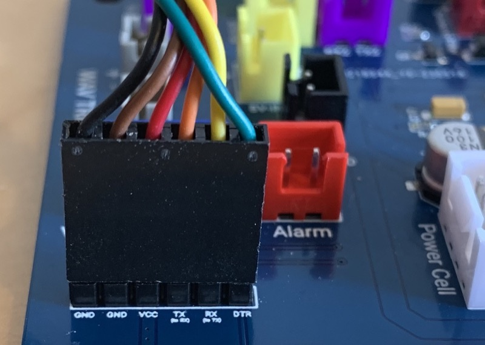

## Supported Devices

### Proton Pack:
 
-  gpstar Proton Pack PCB

### Neutrona Wand:

-  gpstar Neutrona Wand PCB

## +++ IMPORTANT WHEN FLASHING UPDATES +++
If you are flashing updates to your existing setup, make sure that both your Proton Pack and Neutrona Wand Micro SD Cards have all the latest sound effects from this repository.

## Connection to your gpstar Proton Pack and Neutrona Wand PCB
Use the included FTDI to USB programming cable that comes with the gpstar kits or use any other suitable FTDI 5V basic serial connector. The UART Pins on the PCB should align with with the standard wire order for FTDI-to-USB cables which use a single Dupont 6-pin connector. Observe these common colours and notes to ensure proper orientation:

- The ground pin will typically be a black wire, while VCC will typically be red.
- The DTR pin on the PCB will connect to a wire labelled either DTR or RTS.
- Any wire labelled CTS will be connected to the 2nd pin labelled GND on the PCB.
- Be careful to not reverse the connector!

## Flashing Updates
After connecting your gpstar Proton Pack or Neutrona Wand board to your computer with the included FTDI to USB programming cable, download the gpstar firmware flasher from the extra folder and run the program.

(Direct Download link)
[gpstarFirmwareFlasher (exe)](https://github.com/gpstar81/haslab-proton-pack/raw/main/extras/gpstarFirmwareFlasher.exe)

The latest pre-compiled firmware binaries can be found in the binaries folder of this repository.

[https://github.com/gpstar81/haslab-proton-pack/tree/main/binaries](https://github.com/gpstar81/haslab-proton-pack/tree/main/binaries)

`It is recommended to have the Proton Pack and Neutrona Wand on the latest versions of their respective firmware.`

When downloading the binaries, click on the file then on the **`Download raw file`** button.

1. Open the firmware flasher, then select the firmware from the firmware selection box.
2. Then select the COM port for the connection to your gpstar Board. The Default baud rate of 115200 should already be automatically selected. `The COM port # will be different for every user. If you attempt to flash and your gpstar board can not be found, please select another COM port from the drop down menu and try again.`
3. Click on the UPLOAD button and wait for it to complete.

`Note: If connecting the programming cable for the first time to your computer, it may take Windows a few minutes to setup the USB/TTL drivers automatically before it start working.`

## (Optional) Compiling Source Code and Manually Flashing
If you prefer to make adjustments to the source code configuration options instead of flashing pre-compiled binaries, refer to the Compiling and Flashing link below.

* [Compiling and Flashing](COMPILING_FLASHING.md)
