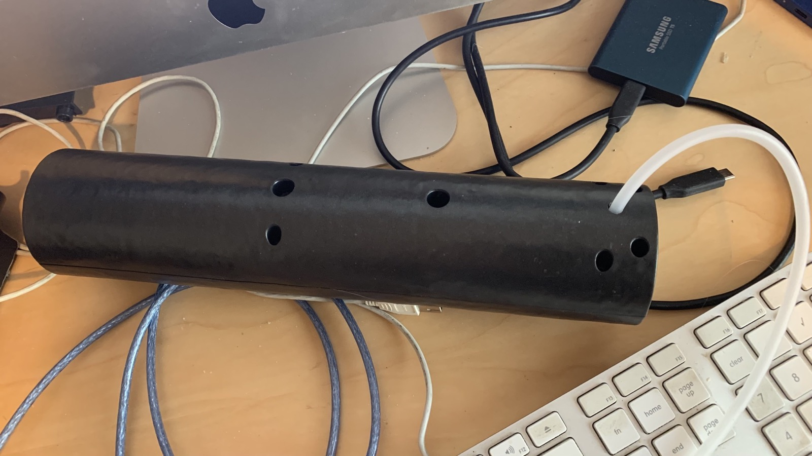

# Smoke Configuration

Below are some examples of how to implement smoke into your Proton Pack.

There are 3 pins on the Mega configured to go HIGH during smoke effect phases. Smoke1 -> Pin 39, Smoke2 -> Pin 35 and Fan 1 - Pin 33. With a simple transistor setup, you can activate pumps, external smoke machine devices, etc.

**WARNING: DO NOT DRAW MORE THAN 40ma FROM A PIN. Use a transistor setup if you need more power.**

## Booster Tube Example

For this example, I used the following parts:

* 1 - Air Pump and Vacuum DC Motor - 4.5 V -> https://www.adafruit.com/product/4699
* 1 - Vape Pen -> https://www.joyetech.com/product/eroll-mac/
* Silicone Tubing for Air Pumps - https://www.adafruit.com/product/4661
* 1 - 1n4001 diode -> https://www.adafruit.com/product/755
* 1 - 330 ohm resistor -> Refer to parts list
* 1 - PN2222 NPN Transitor
* 100% Pure Vegetable Glycerine for the vape pen to generate smoke

I will be using SMOKE2, which is Pin #39 on the Mega. In the pack schematic diagrams, refer to SMOKE2 setup on the breadboard for the connection guide in the PACK instructions for more detail instructions. A quick rundown on what happens is, Pin #39 on the Mega goes high during smoke events, which makes the transistor open and the connected DC pump will then have 5V power which begins to operate. I removed the original battery compartment in the HasLab motherboard, so I have quick access to the vape pen from the battery door on the motherboard when it needs recharging and refilling with more vegetable glycerine.

Here are some photos the basic smoke setup. 

## N-Filter Example

This also uses a vape pen approach with a 3V mini aquarium pump, and can be run from a 3V relay module. The vape pen (T2 Clearomizer style) uses a 1.8 ohm coil and wants about 3.6-4V to make decent smoke. Meanwhile, the pump doesn't like much above 3V and 4V is pushing it. Since both run for short bursts you can split the difference and use 3.8V which is about right for decent smoke AND to push everything out of the cartridge and so far only the coil gets the hottest of all the components.

For the 3V relay, this was paired with a dedicated DC buck converter taking 12V from a Talentcell battery down to the 3.8V, and runs through a toggle so you can completely cut the power to the converter and anything downstream from it. The relay module has an optoisolator and also allows for powering the relay coil from a separate source from the signal, so using  3.8V power it's possible to run both the relay coil and the smoke/pump combo (the relay controls the +3.8V to the smoke/pump combo). This allows the Arduino to send a signal (found to work with 3.3V or 5V) at any time to trigger the relay, but if there's no power from the buck converter via the toggle it's just a no-op (does nothing). This setup with the relay allows the nearly 1amp needed by the vape coil (and pump), so at worst it may only burn out the DC buck converter as the Arduino remains electrically isolated. And if you wanted to use a separate power source just for smoke effects then you can easily do that as well (so long as you have a common ground between. your power sources).