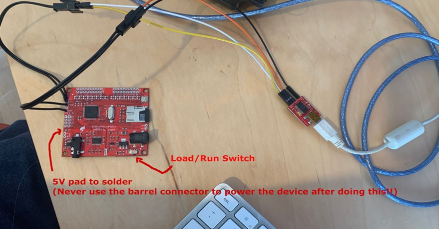

# WavTrigger Configuration

The first thing to take care of is updating the firmware on the Wav Trigger boards. Sometimes they ship with firmware version 1.28, and 1.34 is required for one feature used during music playback. It is possible to use the Wav Triggers without updating the firmware, the only issue you will have is during music playback, when a track ends, the next track will not automatically load and play itself.

The Wav Trigger firmware and software updater and instructions can be found on the Robertsonics website. https://www.robertsonics.com/wav-trigger To update the firmware, an [FTDI Basic (5V)](https://www.sparkfun.com/products/9716) version from Sparkfun can be used.

**Summary Steps:**

1. There is a small switch near the power connect (barrel) to on the Wav Trigger, set it to the “load” position
1. Connect the RX on the FTDI basic to the TX of the Wav Trigger, and TX from the FTDI basic to the RX of the Wav Trigger board.
1. Connect the 5V and GND from both together. 4. Plug in USB cable from computer to the FTDI basic.

**IMPORTANT: You will need to solder the 5V pad on the Wav Trigger to enable 5V power from the device. When you do this, NEVER USE the BARREL CONNECTOR for power. We will be using 5V to power the Wav Triggers for both in the Pack and the Wand.**

NOTE: See photos below for more information. I also wired some connectors to the TX/RX and PWR/GND on the Wav Trigger, this will be a good time to do the same to enable easier connections for in the pack and wand. I used standard breadboard friendly header jumper cables to make the connections from the FTDI basic to the connectors I added to the Wav Trigger. Also note that the Wav Triggers have both a AUX output and or 2 pins for audio output. You can use either or to connect to your speakers or amps.

IMPORTANT: Make sure after flashing the firmware to set the small switch on the Wav Trigger back to the RUN position.

