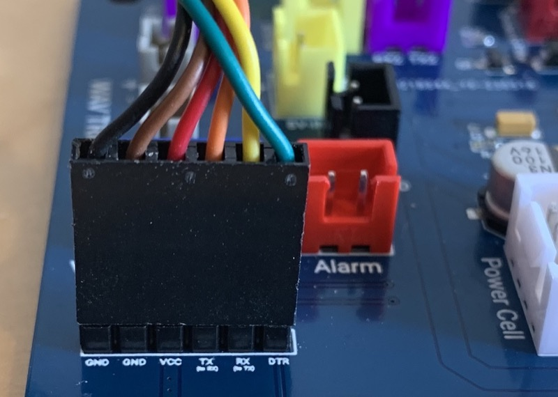

# Software Flashing Guide

Each supported device in the GPStar system (Proton Pack, Neutrona Wand, Attenuator, Single-shot Blaster, Belt Gizmo, Stream Effects) are separate devices and must be updated individually when software updates are available. The following guide focuses on the core system: the Proton Pack and Neutrona Wand. For updating the [Attenuator (aka. Wireless Adapter)](ATTENUATOR_FLASHING.md) or the [Single-Shot Blaster](SINGLESHOT.md), please see their respective guides.

Note that the GPStar Audio may also require updates to firmware, though this will be rare. See the [SOUND](SOUND.md) guide for more information.

## Supported Devices

Please refer to the table below for a list of devices and their supported software release.

| Controller Device | v1.x | v2.x | v3.x | v4.x | v5.x | v6.0 | v6.1+ |
|-------------------|------|------|------|------|------|------|-------|
|  GPStar Proton Pack  Yes | Yes | Yes | Yes | Yes | Yes | Yes | Yes |
|  GPStar Neutrona Wand | Yes | Yes | Yes | Yes | Yes | Yes | Yes |
|  GPStar Single-shot Blaster | &mdash; | &mdash; | &mdash; | &mdash; | Yes | Yes | Yes |
|  GPStar Proton Pack II | &mdash; | &mdash; | &mdash; | &mdash; | &mdash; | &mdash; | Yes |
|  GPStar Neutrona Wand II | &mdash; | &mdash; | &mdash; | &mdash; | &mdash; | &mdash; | Yes |
|  GPStar Single-shot Blaster II | &mdash; | &mdash; | &mdash; | &mdash; | &mdash; | &mdash; | Yes |
| d1 DIY Arduino Mega Proton Pack | Yes | Yes 3 | Yes 3 | Yes 3 | Yes 3 | Yes 3 | Yes 3 |
| d1 DIY Arduino Mega Neutrona Wand | Yes | Yes 2 | Yes 2 | Yes 2 | Yes 2 | Yes 2 | Yes 2 |
| s1 Attenuator (Arduino Nano) | Yes | Yes | Yes | Yes | Yes | No 4 | No 4 |
| s1 Attenuator (ESP32) | &mdash; | &mdash; | Yes | Yes | Yes | Yes | Yes |
| s1 Wireless Adapter (ESP32)  | &mdash; | &mdash; | Yes | Yes | Yes | Yes | Yes5 |
| Belt Gizmo | &mdash; | &mdash; | &mdash; | &mdash; | &mdash; | Yes | Yes |
| Stream Effects | &mdash; | &mdash; | &mdash; | &mdash; | &mdash; | Yes | Yes |

d1 These are now considered as "legacy" devices and have distinct end-of-life notes in later versions (see additional superscript notations).

s1 These are referred to as "Serial1" devices as they attach to the GPStar Proton Pack PCB though they are considered separate devices and will be flashed independently. Please see the [ATTENUATOR_FLASHING](ATTENUATOR_FLASHING.md) guide for those instructions.

2 Support for the Arduino Nano as a wand controller ended after the release of v2.2.0. That device must be replaced with a [Mega 2560 Pro Mini](https://www.amazon.com/s?k=Mega+2560+PRO+MINI) to support the later software releases.

3 If paired with an Arduino Nano for the Neutrona Wand, this arrangement is deprecated. To continue using the DIY Arduino Mega you will need to upgrade the Neutrona Wand to use the GPStar Neutrona Wand PCB or a [Mega 2560 Pro Mini](https://www.amazon.com/s?k=Mega+2560+PRO+MINI).

4 Support for the Arduino Nano as an Attenuator controller ended as of the v6.0.0 release. That device must be replaced with an ESP-WROOM-32 module to support the later software releases.

5 Use of an ESP32 as Wireless Adapter is still supported for GPStar I users, but is no longer necessary for GPStar II kits as they can provide built-in WiFi capability.

## 📝 GPStar II Flashing
The GPStar Proton Pack II and GPStar Neutrona Wand II can be updated wirelessly.

**The WiFi on the GPStar Neutrona Wand II is disabled for power saving measures when it is connected to a GPStar Proton Pack II. Similarly, if you have a Attenuator connected, the GPStar Proton Pack II will turn off its WiFi for power saving. You can manually turn on or turn off the WiFi for each device from the [Wand Operation Menu](OPERATION_MENUS.md) via Menu Level 3**.

- Connect to the respective devices WiFi and navigate to the settings section. Then click on the Update Proton Pack or Neutrona Wand Firmware.

- Use the select file button and select the .bin firmware for the device that can be found in the `/binaries` directory.

- The upload will begin immediately. Once at 100% the device will reboot.

### Connection to your GPStar II Proton Pack and Neutrona Wand PCBs

Under normal circumstances you should only ever have to update the GPStar II boards over-the-air via the web UI as above. As a backup, the GPStar II Proton Pack and Neutrona Wand have a built-in USB-C connector that can be used to connect any computer to the board for manually flashing firmware. Connect a USB-C cable to the device from your computer, then use the GPStar ESP32 Firmware Flasher to update the firmware. See [GPStar II & ESP32 USB Flashing](#gpstar-ii-usb-flashing) below.

## 📝 GPStar I Flashing

1. The same software version should be updated to **ALL** available devices, even if the changelog does not advertise modifications for a certain component. This ensures proper serial communication between devices.
1. If you are flashing updates to your existing setup, make sure that **BOTH** your Proton Pack and Neutrona Wand Micro SD Cards have all the latest sound effects from this repository as found in the [sounds](https://github.com/gpstar81/GPStar-proton-pack/blob/main/sounds/) directory.

### Flashing Updates

After connecting your GPStar Proton Pack or Neutrona Wand board to your computer with the included FTDI to USB programming cable, download the GPStar firmware flasher from the [extras](https://github.com/gpstar81/GPStar-proton-pack/blob/main/extras/) folder and run the program.

**As of the v6.1.0 release, new versions of the flasher utilities are available and are encouraged to be used instead of any older copies.** These provide more integity/size checks for selected files, ensuring you have selected a true binary file.

### GPStar I Pack/Wand Firmware Flasher

- [Windows (x86/x64)](https://github.com/gpstar81/GPStar-proton-pack/blob/main/extras/gpstarFirmwareFlasher.exe?raw=1)
- [MacOS Intel/M1](https://github.com/gpstar81/GPStar-proton-pack/blob/main/extras/GPStar-Firmware-Flasher-Mac.dmg?raw=1)

The latest pre-compiled firmware binaries can be found in the binaries folder of this repository.\
[Binaries Folder](https://github.com/gpstar81/GPStar-proton-pack/blob/main/binaries/)

When downloading the binaries via GitHub, click on the file to open its webpage then click on the **`Download raw file`** button in the upper-right of the page.

**You can also find the latest stable versions of the Firmware and Flashing software at:**

[https://gpstartechnologies.com/pages/support-downloads](https://gpstartechnologies.com/pages/support-downloads)

**IMPORTANT: It is REQUIRED to have both the Proton Pack and Neutrona Wand on the same version of their respective firmware. It is also recommended that this be the latest available firmware.**

### Connection to your GPStar I Proton Pack and Neutrona Wand PCBs

Use the included FTDI to USB programming cable that comes with the GPStar kits or use any other suitable FTDI 5V basic serial connector. The UART Pins on the PCB should align with with the standard wire order for FTDI-to-USB cables which use a single Dupont 6-pin connector. Observe these common colours and notes to ensure proper orientation:

- The ground pin will typically be a black wire, while VCC will typically be red.
- The DTR pin on the PCB will connect to a wire labelled either DTR or RTS.
- Any wire labelled CTS will be connected to the 2nd pin labelled GND on the PCB.
- **Be careful to not reverse the connector!**

📝 **Note:** For the Neutrona Wand, some users have adopted use of the [Hasbro Plasma Series Spengler's Neutrona Wand: Data Port Front Tube](https://www.etsy.com/listing/1756220009/) as offered by RADIsLAB, which includes a parts list for a dedicated programming cable which stay mounted inside of the device.

### Using the Flashing Software

### Windows

1. Open the firmware flasher, then select the firmware from the firmware selection box for the GPStar board you wish to flash.
1. Then select the Port for the connection to your GPStar Board. `Microsoft Windows users: The Default baud rate of 115200 should already be automatically selected.` `The Port will be different for every user and may not look like what you see in the screenshot image. If you attempt to flash and your GPStar board can not be found, please select another PORT from the drop down menu and try again.`
1. Click on the Upload button and wait for it to complete.

`Note: If connecting the programming cable for the first time to your computer, it may take Windows a few minutes to setup the USB/TTL drivers automatically before it starts working.`

### macOS

1. Open the firmware flasher by double-clicking the .DMG file. This will mount a new drive for the application.
1. Go to the mounted drive "GPSTAR-FIRMWARE-FLASHER" and double-click on the `GPStar-Firmware-Flasher.app` to start the program.
1. Select the firmware from the firmware selection box for the GPStar board you wish to flash.
1. Then select the PORT for the connection to your gpstar Board after connecting the gpstar board to your computer with the programming cable. `The PORT will be different for every user and may not look like what you see in the screenshot image.`
1. Click on the UPLOAD button and wait for it to complete.

## Flashing Update Instruction Video

[GPStar I Firmware Update Instruction Video](https://www.youtube.com/watch?v=Hbk-RCVR1ew) (YouTube)

## GPStar II USB Flashing

### GPStar ESP32 Firmware Flasher

- [Windows](https://github.com/gpstar81/GPStar-proton-pack/blob/main/extras/gpstarESP32FirmwareFlasher.exe?raw=1)

The latest pre-compiled firmware binaries can be found in the binaries folder of this repository.\
[Binaries Folder](https://github.com/gpstar81/GPStar-proton-pack/blob/main/binaries/)

When downloading the binaries via GitHub, click on the file to open its webpage then click on the **`Download raw file`** button in the upper-right of the page.

**You can also find the latest stable versions of the Firmware and Flashing software at:**

[https://gpstartechnologies.com/pages/support-downloads](https://gpstartechnologies.com/pages/support-downloads)

**IMPORTANT: It is REQUIRED to have both the Proton Pack and Neutrona Wand on the same version of their respective firmware. It is also recommended that this be the latest available firmware.**

### Using the Flashing Software

1. Open the firmware flasher, then select the bootloader, partition file, boot_app0, and firmware in the appropriate selection boxes for the GPStar board you wish to flash.
1. Then select the Port for the connection to your GPStar Board. `Microsoft Windows users: The Default baud rate of 921600 or 115200 should already be automatically selected.` `The Port will be different for every user and may not look like what you see in the screenshot image. If you attempt to flash and your GPStar board can not be found, please select another Port from the drop down menu and try again.`
1. Click on the Upload button and wait for it to complete.

`Note: If connecting the programming cable for the first time to your computer, it may take Windows a few minutes to setup the USB/JTAG drivers automatically before it starts working.`

## (Optional) Compiling Source Code and Manually Flashing

If you prefer to make adjustments to the source code configuration options instead of flashing pre-compiled binaries, refer to the Compiling and Flashing link below.

* [Compiling and Flashing](COMPILING_FLASHING.md)
