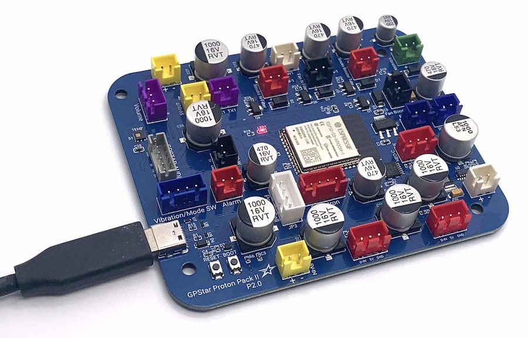
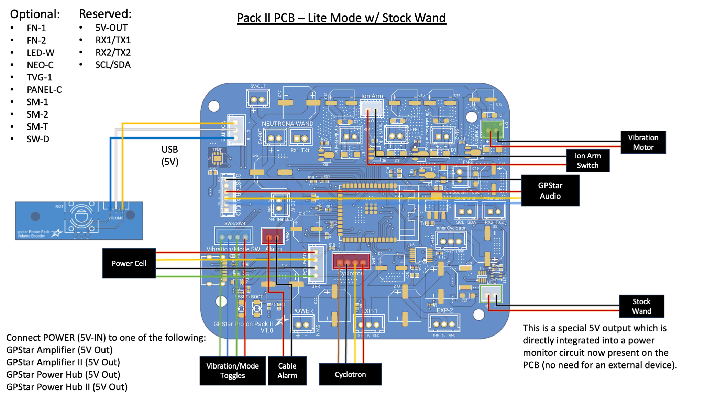
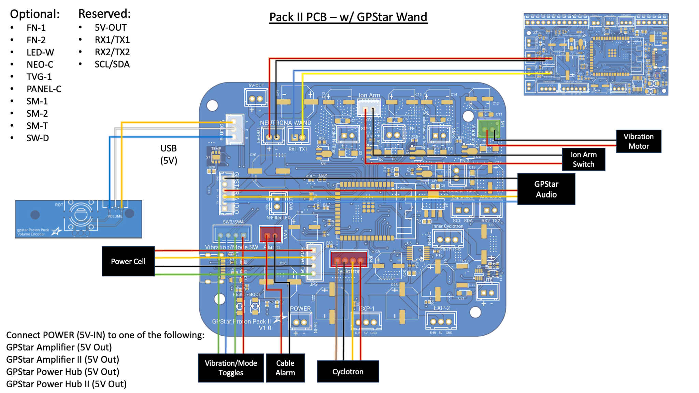
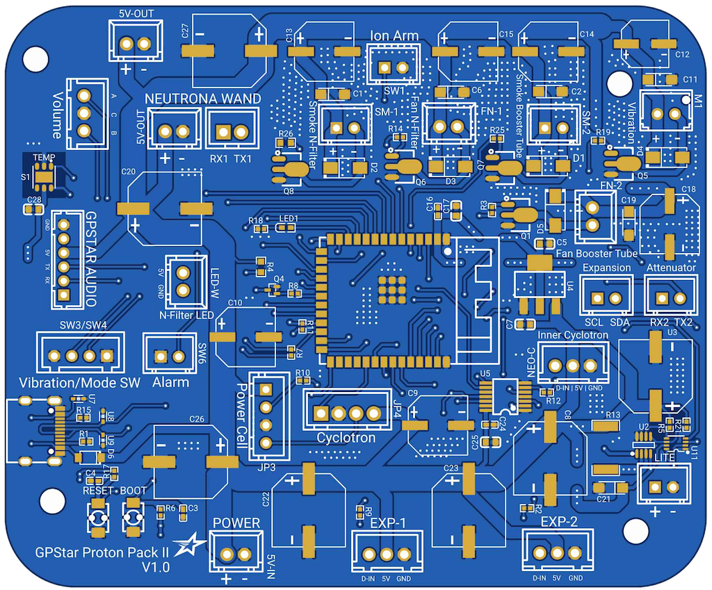

<h1> GPStar Pack II PCB Hookup</h1>

&starf; For a comparison of the original GPStar and GPStar II controllers please see [this comparison guide](https://gpstartechnologies.com/blogs/gpstar-blog/gpstar-ii-vs-gpstar) on the main GPStar website.

Welcome to the second generation of GPStar Proton Pack controllers, intended for users who wish to fully replace the stock lighting of their Haslab Proton Pack or are building a DIY pack. This device improves on several core feature changes based on real-world use and customer requests.

**Significant Features/Changes:**

- Processor change to ESP32-S3 SoC instead of ATMega2560, offering dual CPU cores operating at a faster clock speed.
- Temperature sensor for environmental responses or monitoring.
- Dedicated sockets for optional components and future expansion.
- Integrates a WiFi radio for direct web-enabled controls and firmware updates.
	- Compatibility with an Attenuator device is still fully supported. When connected to an Attenuator which offers WiFi capability, the Proton Pack II PCB will automatically disable its internal WiFi radio to conserve power.

**Other Hardware Changes:**

- Programming pins were replaced with a USB-C connector for direct connectivity to your computer for firmware updates.
- Integrates a power detection unit directly onboard, eliminating a separate sensor for "GPStar Lite" kits.
- The cyclotron switch panel which used individual LEDs is no longer compatible with this controller, and must be upgraded to the RGB LED panel if you wish to keep that device illuminated.
- The cyclotron direction switch has been removed in favor of more specialized connectors.
  - This can be controlled via the Neutrona Wand menu or WiFi web interface.

**IMPORTANT: The GPStar Pack II controller is NOT backwards compatible with the original GPStar Wand controller! DO NOT attempt to mix and match wands as you can potentially damage your devices.**

This guide is part of the kit approach to providing a minimally-invasive upgrade to the stock HasLab controllers. For the Proton Pack all stock connections can be made using the available JST-XH connectors on all existing wiring. The diagram below details the standard HasLab connections, supporting either a "Lite" configuration with a stock Neutrona Wand or a fully-converted wand with GPStar Wand II controller.

If using a stock Neutrona Wand you will need to use the supplied 5V output on the LITE connection. This will provide the power meter readings from user interaction.

If using a GPStar modified Neutrona Wand you will need to use the labelled NEUTRONA WAND connections for serial data and power.

## Proton Pack - Connection Details

Connections for the pack should be made according to the tables below.

- Ordering aligns with PCB labels or when viewed left-to-right with the connector keyhole at the bottom.
- Pins denoted D# correspond to the internal code and connection to the controller chip.
- Ground may be designated as "GND" or simply "-".

### Stock Connectors

These are connections which should match 1:1 on the original Haslab Proton Pack if upgrading from that product.

| Label | Pins | Notes |
|-------|------|-------|
| POWER 5V-IN | +/\- | Power from GPStar amplifier or power hub. **This MUST be a regulated 5V source!** |
| Volume | D3/GND/D2 | Rotary encoder connection for pack volume adjusted via crank generator knob. |
| SW1 | D31/GND | Stock connection for main switch under the Ion Arm. |
| SW3/SW4 | GND/D27/D25/GND | Stock connection for Cyclotron panel toggles:  SW3 (2 pins on left side) = Year Mode Toggle. SW4 (2 pins on right side) = Vibration toggle. |
| SW6 (ALARM) | GND/D23 | Stock connection for ribbon cable disconnection alarm (wire order does not matter). |
| M1 | VCC/GND | Stock connection for pack vibration motor (D45) or cyclotron motor1. |
| Power Cell | VCC/D53/GND/PCCYC | Stock connection for Power Cell LEDs (continues to Cyclotron Lid). |
| Cyclotron | D43/GND/PCCYC/VCC | Stock connection Cyclotron lens LEDs (continues from Power Cell), includes lid sensor. |

1 For more information on the motorised cyclotron modification see [Inner Cyclotron](CYCLOTRON_INNER.md).

### Special Connectors

These are connections which are unique to the GPStar equipment or have a special purpose.

| Label | Pins | Notes |
|-------|------|-------|
| AUDIO BOARD | GND/NC/VCC/TX/RX/NC | Communication and Power for the pack's GPStar Audio or WAV Trigger.  `Connector type: JST-PH` |
| NEUTRONA WAND 5V-OUT | +/\- | Power to the Neutrona Wand. If using the GPStar Amplifier it is encouraged that you use one of the 5V connections on that device to directly power the Neutrona Wand instead of using this connection.  `Connector type: JST-XH` |
| NEUTRONA WAND (Serial) | RX1/TX1 | Serial communication to the Neutrona Wand. **IMPORTANT: The GPStar Pack II controller is NOT backwards compatible with the original GPStar Wand controller! DO NOT attempt to mix and match wands as you can potentially damage your devices.**  `Connector type: JST-XH` |
| LITE | INA219 | Built-in power sensor for "Lite" kits using a stock wand |
| USB-C | Socket | This controller now comes with a standard USB-C socket for programming, though it is now possible to update using over-the-air (OTA) process via the WiFi and web interface |

### Optional Connectors

These connections are reserved for special purposes with optional accessories.

| Label | Pins | Notes |
|-------|------|-------|
| SM-T | GND/D37| Smoke Toggle switch to enable/disable smoke effects (wire order does not matter).  `Connector type: JST-XH`|
| SM-1 | \-/+ | Smoke effects for the N-Filter (D39). SM-1 provides 5V during N-Filter smoke effects. You can connect a 5V pump to this pin to power it, or use it to trigger a relay for off the shelf smoke solutions.  `Connector type: JST-XH`  `Do not draw more than 1.5amps from this connector.` |
| FN-1 | \-/+ | Fan for N-Filter smoke (D33). FN-1 provides 5V during N-Filter smoke effects. During the overheat sequence, it is timed to go off at the same time as the N-Filter light. You can connect a 5V fan to this pin if desired or to trigger a relay.  `Connector type: JST-XH`  `Do not draw more than 1.5amps from this connector.` |
| SM-2 | \-/+ | Smoke effects for the Booster Tube (D35). SM-2 provides 5V during Booster Tube smoke effects. You can connect a 5V pump to this pin to power it, or use it to trigger a relay for off the shelf smoke solutions.  `Do not draw more than 1.5amps from this connector.` |
| FN-2 | \-/+ | Fan for the Booster Tube smoke (D50). FN-2 provides 5V during Booster Tube smoke effects. You can connect a 5V fan to this pin if desired or use it to trigger a relay.  `Connector type: JST-XH`  `Do not draw more than 1.5amps from this connector.` |
| NEO-C | D13/VCC/GND | Connection for the optional RGB LED cyclotron switch panel and RGB LED ring for the Inner Cyclotron "Cake".  `Connector type: JST-XH`|
| EXP-1 | D41/5V/GND | Reserved for possible future expansion  `Connector type: JST-XH` |
| EXP-1 | D42/5V/GND | Reserved for possible future expansion  `Connector type: JST-XH` |
| LED-W | D46/GND | Connection for a standalone white LED in the N-Filter. D46 provides 5V and has a 100Ω resistor connected to it.  `Connector type: JST-XH`  `Do not draw more than 40mA from this connector.` |
| 5V-OUT | +/\- | Power for additional accessories. Commonly used to power an ESP32 wireless board or Attenuator.  `Connector type: JST-XH`  `Do not draw more than 1.5amps from this connector.` |
| EXPANSION | SCL/SDA | Expansion serial port for future devices using the I2C bus.  `Connector type: JST-XH`|
| ATTENUATOR | RX2/TX2 | Expansion serial port. Used to connect to an Attenuator device.  `Connector type: JST-XH` |
