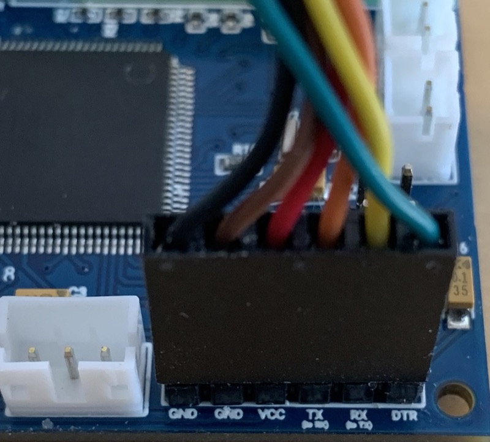

# Single-Shot Blaster

## What's This?

aka. Wrist Thrower, Compact Arm Thrower, Frozen Empire Arm Gauntlet

It may go by many names, though we know it as the arm-mounted Neutrona Wand as seen in Frozen Empire. For purposes of this guide we'll use the official name straight from the source when [Adam Savage met the propmaster for a look at the device](https://www.youtube.com/watch?v=2YypkmcPjQ8). This guide covers the use of components as typically used for a standard Neutrona Wand, repurposed to bring life to this device.

## External Shell

There is no shortage of resources for the device shell itself, as it has been modeled and remixed by several members of the Ghostbusters community. Below are some of the found sources offering either the 3D files or pre-printed parts. If you know of another resource for either please let us know and we'll update this list.

- [3D Files by EctoLabs](https://github.com/EctoLabs/wrist-thrower)
- [3D Files by Right Coast Creative (Craig Rivest, aka. @scoleri_brothers)](https://rightcoastcreative.com/ghostbusters/p/frozen-empire-arm-gauntlet)
- [Ghostbusters Frozen Empire Compact Arm Thrower by ShapeforgeProps](https://www.etsy.com/listing/1700904381/ghostbusters-frozen-empire-compact-arm)

## Bill of Materials

The following list of parts will allow you to assemble the electronics and internal components to run the device. For a complete list of additional cosmetic parts and advice on assembly of the external components please see the incredibly detailed [Build Guide on GBFans](https://www.gbfans.com/forum/viewtopic.php?t=51824) by EctoLabs.

Electronic components are available as a single kit purchase as the
[GPStar II Single Shot Kit](https://gpstartechnologies.com/products/gpstar-ii-single-shot-kit). The kit will provide the following components, with exception of a battery:

* GPStar Neutrona Wand II
* GPStar Audio
* GPStar Power Boost USB-C
* GPStar Jewel (x2)
* GPStar Neutrona Wand Encoder
* GPStar RGB Vent Light
* 28 Segment Bargraph
* Visaton K36WP Speaker (2 watts / 8ohm)
* 3 Toggle Switches
* Intensify Toggle Button
* PBS-33B Yellow Toggle Button pre-crimped with JST-PH housing
* Various pre-wired LED lighting
* Small slide switch to enable/disable power.

Due to shipping limitations of lithim-ion batteries you must provide the necessary power source by purchasing in your locale. Battery power must be at least 2500mAh (2.5Ah) to provide sufficient power to the GPStar Power Boost USB-C, which both provides regulated power and offers a way to directly recharge the battery. This device will draw around 0.8A at full volume.

Options for a suitable 3.7V LiPo or Li-Ion Battery (minimum 2500mAh):

* [https://a.co/d/gQlJsY0](https://a.co/d/gQlJsY0)
* [https://a.co/d/gML6MVC](https://a.co/d/gML6MVC)

## PCB Connection Details

Connections for the device should be made according to the tables below.

- Ordering aligns with PCB labels or when viewed left-to-right with the connector keyhole at the bottom right.
- Pins denoted A#/D# correspond to the internal code and connection to the controller chip.
- Ground may be designated as "GND" or simply "-".
- Either the GPStar I Neutrona Wand or GPStar II Neutrona Wand controller

### Common Socket Connections (JST-PH)

| Label | Pins | Notes |
|-------|------|-------|
| 5V-IN | +/\- | 2-pin JST-PH for power from GPStar Power Boost USB-C **This MUST be a regulated 5V source!** |
| Q2 | VCC/D10/GND | 3-pin JST-PH connection for all addressable LEDs3 |
| SW45/SW4 | GND/D2/GND/D3 | 4-pin JST-PH connection for the Intensify button and Activate toggle |
| SW6 | GND/A6 | 2-pin JST-PH connection for the hand-grip mode/fire switch |

3 The 3-pin connector for the LEDs will connect to a pair of 7-LED "jewel" boards as built by GPStar Technologies. These will be installed and addressed by the controller in the order of the barrel first, followed by the cyclotron.

### Wire Connectors (Terminal Blocks)

For GPStar Neutrona Wand I

| Label/Pin | Notes |
|-----------|-------|
| D8 | Slo-Blo VCC |
| GND | Slo-Blo GND |
| D4 | Lower-right Toggle (wire order does not matter) |
| GND | Lower-right Toggle (wire order does not matter) |
| A0 | Upper-right Toggle (wire order does not matter) |
| GND | Upper-right Toggle (wire order does not matter) |
| D9 | Clippard LED (Top Left) VCC |
| GND | Clippard LED (Top Left) GND |
| R+ | Rumble (vibration) motor VCC |
| R- | Rumble (vibration) motor GND |
| - | - |
| VCC | Power (+) for rotary encoder |
| D12 | Blinking top right LED / RGB vent light data |
| D13 | White vent light LED |
| VL+ | VCC for top/vent lights |
| D7 | Rotary encoder B (DT) |
| D6 | Rotary encoder A (CLK) |
| ROT- | Ground for rotary encoder |

For GPStar Neutrona Wand II

| Label/Pin | Notes |
|-----------|-------|
| D8 | Slo-Blo VCC |
| GND | Slo-Blo GND |
| D4 | Lower-right Toggle (wire order does not matter) |
| GND | Lower-right Toggle (wire order does not matter) |
| A0 | Upper-right Toggle (wire order does not matter) |
| GND | Upper-right Toggle (wire order does not matter) |
| 5V+ | Clippard LED (Top Left) VCC |
| D9 | Clippard LED (Top Left) GND |
| R+ | Rumble (vibration) motor VCC |
| R- | Rumble (vibration) motor GND |
| - | - |
| GND | Ground for RGB Top/Vent Light |
| D12 | Data for RGB Top/Vent Light |
| D7 | Rotary encoder B (DT) |
| D6 | Rotary encoder A (CLK) |
| ROT- | Ground for rotary encoder |

### Special Connectors

| Label | Pins | Notes |
|-------|------|-------|
| HAT2 | GND/D23 | Connection for the wand box hat LED.  The left (top in the photo) pin is GND, the right (bottom in the photo) pin is D23 provides 5V and has a 150Ω resistor connected to it.  `Connector type: JST-PH`  `Do not draw more than 40mA from this connector.`|
| SCL/SDA | SCL/SDA | Reserved for the [28-segment or 30-segment bargraph](BARGRAPH.md) using I2C.  `Connector type: JST-PH`|
| 5V-OUT | +/\- | Power for the bargraph.  `Connector type: JST-PH` |
| AUDIO BOARD | GND/NC/VCC/TX/RX/NC | Communication and Power for the wands's GPStar Audio or WAV Trigger.  `Connector type: JST-PH` |
| ICSP | DO NOT USE! | Programming header for bootloader updates (reserved, for GPStar I only).  `Connector type: Header pins` |
| UART | See Below | Programming header for software updates (optional, for GPStar I only).  `Connector type: Header pins` |

For connecting the UART pins on the GPStar I controller, use a suitable FTDI chip such as the same **FTDI Basic 5V** used for programming the GPStar Audio or WAV Trigger. Pins on the PCB should align with with the standard wire order for FTDI-to-USB cables which use a single Dupont 6-pin connector. Observe these common colors and notes to ensure proper orientation:

- The ground pin will typically be a black wire, while VCC will typically be red.
- The DTR pin on the PCB will connect to a wire labelled either DTR or RTS.
- Any wire labelled CTS will be connected to the 2nd pin labelled GND on the PCB.
- Be careful to not reverse the connector!

## Battery Power

Per the bill of materials above, use of a 2500mAh or higher battery is crucial for supplying enough power for a full day of use. This **MUST be a Lithium battery** (either LiPo or Li-Ion) with a 3.7V output. The charging circuit is intended for use with Lithium batteries only. **Again, Lithium!**

Both the GPStar Power Boost device for boosting and charging your battery offer 2 pairs of pins which are of importance here:

### Power Switch (Optional, but Recommended)

Adding a switch to the GPStar Power Boost device will allow you to fully turn off the device without draining the rechargeable battery. By default the device is always on and converting the 3.7V source to 5V for the electronics.

**EN** - This is the 'enable' pin. To turn off the booster, connect this pin to ground. The switch can be as small as you like, it is just a signal. When the chip is disabled the output is completely disconnected from the input.

**GND** - This is the shared ground connection which may be used with the 'EN' pin.

### Boosted Output

**5V OUT** - This is the boosted output. The pin closest to the USB-C port is the (+) while the further pin is (-).

## Operation Guide

Full guide will be written as features are completed and operation is determined.

### Entering The Menu System

To enter the settings menu, press the grip button while the two left switches are in the **DOWN** position.

### Navigation

Use the `Top Dial` on the top of the blaster to navigate up and down through the menu system.

When you are in the settings menu system the bargraph's 5 LEDs begin flashing (or 5 distinct segments when using the 28-segment or 30-segment bargraph). All other functions of the blaster (such as firing) are temporarily disabled while in the menu system. There are 5 different menu options, which are indicated by bargraph LED segments 1 through 5 (from bottom to top) with option 5 being the default upon entering this mode. For example in navigation, when 1 LED (or bargraph segment) is flashing/displayed that means you are on `Option 1`.

### Action Levels

Changes are made by pressing either the `Intensify` button on the gun box or the `Grip Button` at the end of the blaster.

#### Menu Level 1

| Option | Purpose | Intensify Button | Grip Button |
|:------:|---------|------------------|--------------------|
| 5️⃣ | Music&nbsp;Track&nbsp;Looping | Enable/disable looping of current track | Exit the menu system1 |
| 4️⃣ | Master&nbsp;Volume&nbsp;Controls | Mute the Single Shot Blaster or revert back to the previous volume | `(Grip Button + Top Dial)` Increases/Decreases Master Volume |
| 3️⃣ | SFX Volume | `unused` | `(Grip Button + Top Dial)` Increases/Decreases SFX Volume |
| 2️⃣ | Switch&nbsp;Music&nbsp;Track | Cycle backwards in music queue | Cycle forward in music queue |
| 1️⃣ | Music&nbsp;Controls | Start/stop music playback | `(Grip Button + Top Dial)` Increases/Decreases Music Volume |

1 When you navigate back to `Option 5` and press the `Grip Button`, the blaster will return to idle (if menu was entered while blaster was on) or save all settings to EEPROM (if menu was entered while blaster was off). Note that music will continue to play (and advance/loop) even when the blaster is turned off.

#### Menu Level 2

📝 **Note:** The Single Shot Blaster Menu Level 2 can only be reached while the Single Shot Blaster is turned off.

To access Menu Level 2, use the `Top Dial` on the top of the blaster to move down and past `Option 1` on Menu Level 1. When you reach the the next menu level, an audio cue will play and the **Slo-Blo LED** will light up to indicate this menu state.

| Option | Purpose | Intensify Button | Grip Button |
|:------:|---------|------------------|--------------------|
| 5️⃣ | Vent&nbsp;Light&nbsp;Toggles | Toggle whether the vent light on the Single Shot Blaster will change brightness depending on power | Enable/Disable the optional addressable RGB LED vent/top light |
| 4️⃣ | Boot&nbsp;Errors / Invert&nbsp;Bargraph | Enable/Disable boot-up error if switches are flipped in the wrong order | Toggle bargraph animation direction |
| 3️⃣ | Vibration&nbsp;Settings / GPStar&nbsp;Audio&nbsp;LED&nbsp;Control | Enable/Disable the status LED on GPStar Audio (if equipped) | Cycle through Single Shot Blaster vibration options |
| 2️⃣ | `unused` | `unused` | `unused` |
| 1️⃣ | `unused` | `unused` | `unused` |

## Firmware Updates

Please follow the standard [FLASHING guide](FLASHING.md) using the `binaries/blaster/SingleShot.hex` firmware file for GPStar I or `binaries/blaster/SingleShotII.bin` for GPStar II.

## Software Development Requirements

As of the v5.4.0 release the development platform of choice for this device has been migrated from Arduino IDE to the [VSCode with PlatformIO](VSCODE.md). Please follow the linked guide for installing the core software and plugins required. All libraries required by the project will be downloaded automatically.