# Smoke Effects

Both the [GPStar Proton Pack PCB](PACK_PCB.md) and [DIY Arduino](DIY_PACK.md) approaches can support up to 2 separate smoke options for the N-Filter and Booster Tube to provide atmospheric effects while operating your Ghostbusters equipment. These effects are automatically triggered during certain interactions and typically after pre-set times through use of 5 JST-XH connections configured to provide DC power during smoke effect phases:

- Smoke1 aka. N-Filter Smoke `SM-1 - GPStar Proton Pack PCB` or `Pin 39 - Arudino Mega`
- Smoke2 aka. Booster Smoke `SM-2 - GPStar Proton Pack PCB` or `Pin 35 - Arduino Mega`
- Fan1 aka. N-Filter Fan `FN-1 - GPStar Proton Pack PCB` or `Pin 33 - Arduino Mega`
- Fan2 aka. Booster Fan `FN-2 - GPStar Proton Pack PCB` or `Pin 50 - Arduino Mega`
- LED-W aka. N-Filter Light `LED-W - GPStar Proton Pack PCB` or `Pin 46 - Arduino Mega`

**Note: Fan1 is set to run during overheat sequence only. It is useful for pushing smoke through the N-Filter**

**Note: Fan2 is set to run at the same time as Smoke2. This was requested if you want to instead use Smoke2 from the booster tube for another purpose. For the purpose of smoke in the booster tube, Fan2 is not required.**

## What is a "Smoke Kit"?

Before proceeding it should be made clear what exactly a "smoke kit" consists of. In simplest terms this is a combination of 4 components: a vape coil (atomizer), an air pump, a fan or blower, and a white LED. Traditionally, the vape coil will be paired directly with the air pump as it is dangerous to run a vape coil without proper airflow. The fan and LED may either be separated or combined--there are many community makers of smoke kits with various implementations where components may be bundled differently.

For modders who are comfortable with building their own smoke solution we recommend [this guide to creating your own smoke generator](SMOKE_DIY.md). For purposes of integrating and connecting a smoke solution please read the remainder of this guide.

### Common Materials

The following may be necessary to connect your smoke generator to the Proton Pack, if not provided as part of a maker's kit.

- [5V Relay Module with Optocoupler](https://a.co/d/h0b5SN5) - Must support a HIGH signal to turn the relay on!
- [6mm OD / 4mm ID Silicone Tubing](https://a.co/d/7qeekAG) - For routing smoke from the vape coil

### Disclaimers

**This project does not make any direct endorsements of kits available in the Ghostbusters community.** As stated above most kits consist of common components which can be integrated in a few standard ways. All references to kits or makers by name is for illustrative purposes only as this team has directly confirmed operation with the kit makers. If you have a smoke kit and wish to validate integration, please reach out to the team via the [GPStar Technologies Facebook group](https://www.facebook.com/groups/gpstartechnologies) for assistance.

Most smoke kits utilize a combination of vegetable glycerine (VG) and propylene glycol (PG). Please follow any kit maker's instructions for filling or replacing your smoke fluid. Some ratios work better for the type of smoke desired and may be a personal preference. The most common are either 100% VG or a 70/30 mixture, where the latter may create thicker smoke.

### Warnings

Modification of your pack is unavoidable for proper installation as the areas where smoke must be delivered are isolated from the inside of the pack. Please proceed only if you are comfortable with **irreversible modifications**. One such recommended modification is the full removal of the D-Cell battery compartment which will allow access through the battery door to installed vape coils for easy refilling. Other modifications include drilling holes to fit wires and/or silicone tubing.

In both the PCB and DIY approaches each of the smoke and fan pins are designed to use a transistor to run connected devices, as most devices will require more than the recommended 40mA maximum of current through the ATMega controller. Please note the following guidelines and warnings regarding safe connection of these devices:

- All connectors listed above provide 5V of DC power and are intended to power devices such as relays, pumps, and fans.
- **Do not connect any device which draws more than 500mA of current to your controller.** Most fans/blowers and relays can be safely attached to the Fan1 or Fan2 ports without concern as these require 500mA or less to operate. The LED-W port expects a white LED with a forward voltage of 3.0-3.2V and current draw of 20mA.
- The Proton Pack PCB has been tested using up to 2 Amps of current but is **NOT** recommended as some components may be pushed to their thermal limits and could potentially fail prematurely under extended use.
- Most vape coil and air pump combinations require dedicated power sources or may require a 12V power source.
- **ALWAYS use a relay module to complete the circuit to power these types of devices!**

### Powering a Kit

Power should be provided as recommended by your kit manufacturer. Most kits run on either 5V or 12V sources so this will determine the best way to implement a power connection. Though in most cases kits operate on the principle of "apply power, get smoke" so the only concern is how to turn the 5V (HIGH) signal from the PCB or Arduino into something which can safely run a vape coil and air pump combination. So we have 2 steps to take: 1) how to get power for the smoke kit(s) and 2) how to switch on power safely.

Now before we begin with how to power your kit, take a look at this video which shows the correlation between voltage to the vape coil and how much amperage is consumed during operation. Typically most vape coils used with many kits are 1.8ohms and like their voltage in the range of 3.3-4V, though 5V can and will work fine. Just remember that more voltage means more current, which means more strain on your battery. So if you are short on available power or have a reduced runtime you can potentially look at reducing the voltage by use of a buck converter for just the vape coil itself.

**Step 1: Providing Power**

As of mid-2024 there are now 2 standard options available for obtaining power easily from a Talentcell battery: the GPStar Amplifier and the GPStar Power Hub. Both devices accept 12VDC from the 5525 barrel jack on the common Talentcell batteries, and both use an on-board 5V regulator which is capable of delivering up to 3A of power.

**WARNING** Do not operate more than 1 smoke kit from the amplifier. This device must consume power to run the speakers, and is also meant to provide power easily to the Proton Pack controller. This can result in pushing the voltage converter (and battery) to its stated limit and will result in poor performance from attempting to run 2 smoke kits simultaneously.

The power hub device is meant to provide dedicated power to high-current devices. It has been tested by operating 2 smoke kits (5V each, at ~1.5A) simultaneously without issue. The primary and expected use-case is when used with a second Talentcell battery reserved exclusively for powering smoke effects.

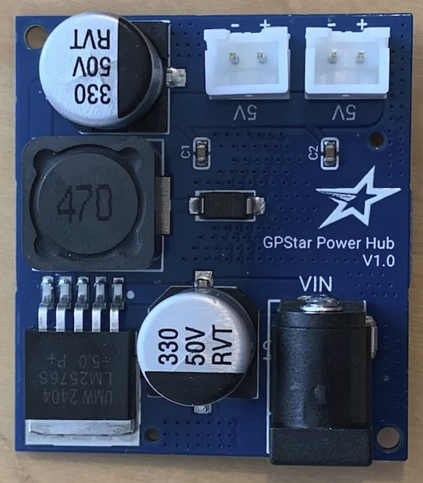

Some additional but optional parts which may be required for these devices:

- [2-Pin JST-XH Connectors w/ Wires](https://a.co/d/04P0tpU1) - For connecting relay modules to the 5V ports on the amp or power hub.
- [Male USB w/ Short Pigtail Cable](https://a.co/d/0haOIelI) - For connecting directly to the USB port of a Talentcell battery.
- [Male 5.5mm x 2.5mm Pigtail Cable](https://a.co/d/0ii1iarB) - For connecting the amp to a battery using the available terminal screws.
- [Male-to-Male 5.5mm x 2.5mm Cable](https://a.co/d/02pffX00) - For connecting the amp or power hub to a Talentcell battery.

**Step 2: Switching Power**

As previously noted in the warnings section, this is where a 5V Relay Module becomes necessary. For a 5V relay, this device will electrically isolate the power provided by the PCB or Arduino from the power source running the smoke generator. This is the recommended solution for safely turning on your smoke generator. Remember that most vape coils will draw 1.5 to 2 Amps so your power supply must be able to provide that safely without triggering a safety shutoff.

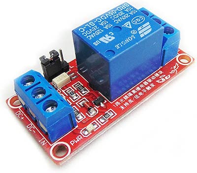

Most relays work using 3 wires: 2 for power (+/-) to the relay itself, and 1 for the signal to turn the relay on or off. One solution is to use a relay which can accept a HIGH signal to turn on and use the + connection to drive both the relay power and input signal. This arrangement typically uses less than 100mA and can safely connect to the Smoke1 or Smoke2 connectors.

Typically the vape coil and air pump will have their positive leads connected together, and the negative leads connected together. The positive from the power source will be connected to the NO (normally-open) terminal on the relay module while the combined positive leads are connected to the COM (common) terminal. The negative leads should connect directly to the power source for the smoke generator.

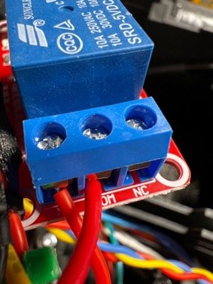

## Connection Examples

For a more in-depth look at the electrical connections, the following diagrams demonstrate what is required for integrating several smoke kits available from the community. These have been either directly verified or confirmed as "expected" by their respective makers. Other kits or DIY solutions may be used, provided they adhere to the use of a relay for applying power directly to a vape coil device. Refer to any kit makers' instructions and recommendations for power sources and connecting cables.

This solution uses a vape pen with its own built-in battery for power:

The following demonstrate common kits which require 5V for operation:

* The GPStar Power Hub may be used in place of the DC buck converter shown

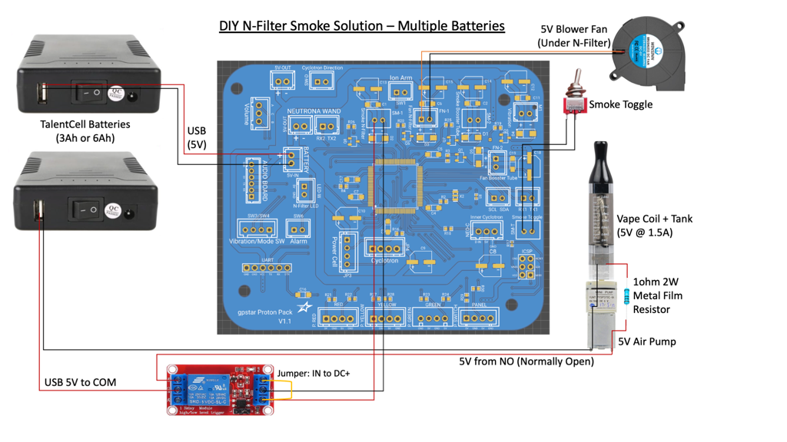

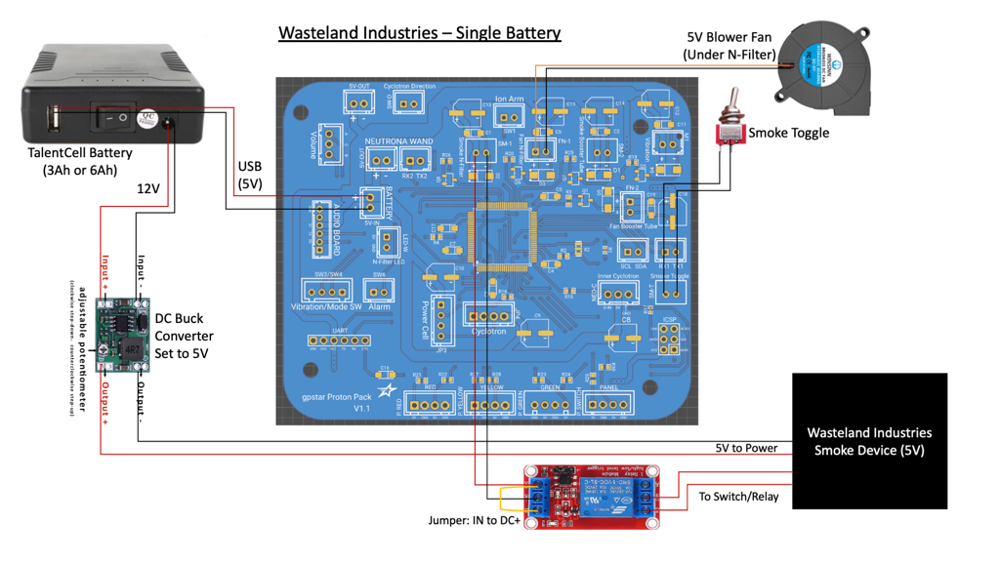
* The GPStar Power Hub may be used in place of the DC buck converter shown

This device uses its own power supply for smoke, but must connect a 5V RF transmitter directly to the controller:
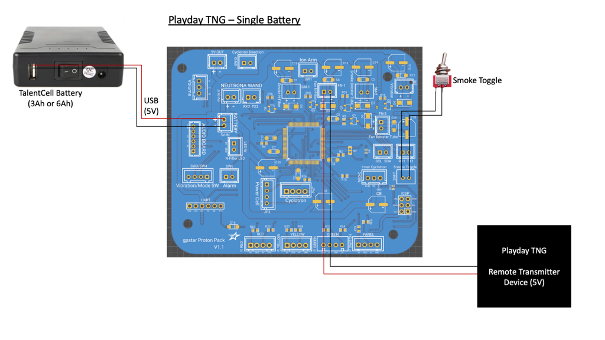

The following demonstrates how to connect a smoke kit which requires a 12V supply:

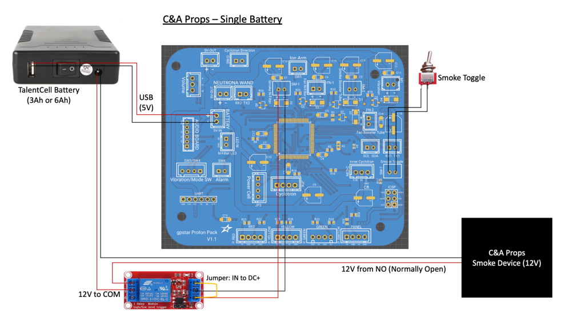

## Booster Tube Installation

The process involves removing the booster tube for easy access and drilling a small hole at the bottom for insertion of silicone tubing. The space below the stock D-Cell battery compartment is convenient for housing smoke generators though as noted it may be easier to access by cutting away the battery compartment itself. If using a 3rd-party motherboard, opt for the version which retains a battery door for easy access once the pack is reassembled and attached to an ALICE frame.

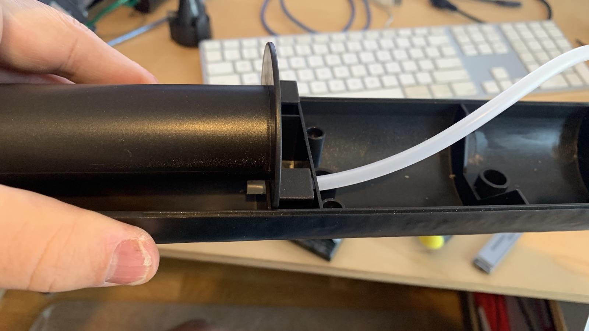

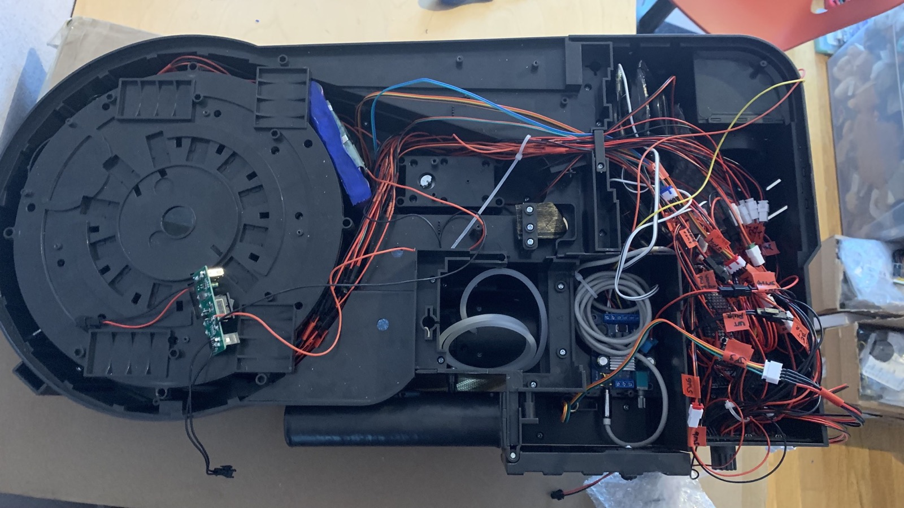

Note: For this component a fan is not necessary as the smoke will rise through use of only the air pump device.

## N-Filter Installation

The following 3D models are provided for those able to print components for their pack. These are designed to fit perfectly within the Hasbro equipment and provide a familiar look to the end solution for getting smoke out of your pack.

- [N-Filter Blower Mount](https://github.com/gpstar81/GPStar-proton-pack/stl/pack/Haslab/N-Filter Smoke/N-Filter Blower.stl?raw=1) - Holds the 50mm blower in an upright position
- [N-Filter Filter Cone](https://github.com/gpstar81/GPStar-proton-pack/stl/pack/Haslab/N-Filter Smoke/N-Filter Cone.stl?raw=1) - Replaces the stock cone and allows smoke and air to exit
- [N-Filter Template](https://github.com/gpstar81/GPStar-proton-pack/stl/pack/Haslab/N-Filter Smoke/N-Filter Template.stl?raw=1) - Used to mark where to cut into the pack for smoke tubing and blower air hole

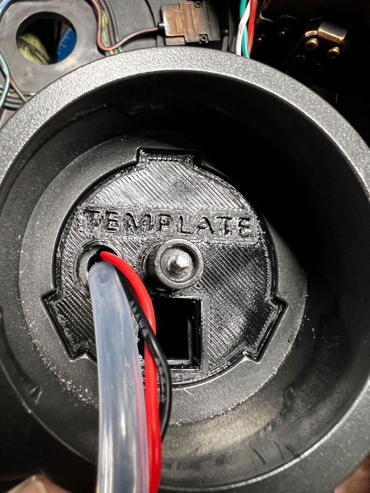

The template print will help identify the correct placement for holes which will allow the silicone tubing and LED power wires to pass through, as well as the port opening for the blower fan. Place this with the word TEMPLATE facing up for the proper orientation.

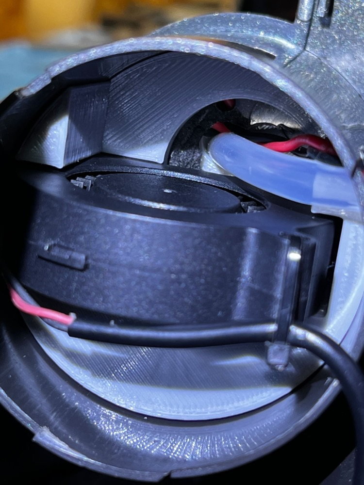

Once the holes are drilled you can simply insert the blower mount into the socket from below. There will be space to access the screw which holds the cone in place, as well as routing the silicone tubing and LED power wires. The blower will be held in place by the other half of the inner cyclotron housing once reassembled--this should be done last, after the cone has been fully installed and tested.

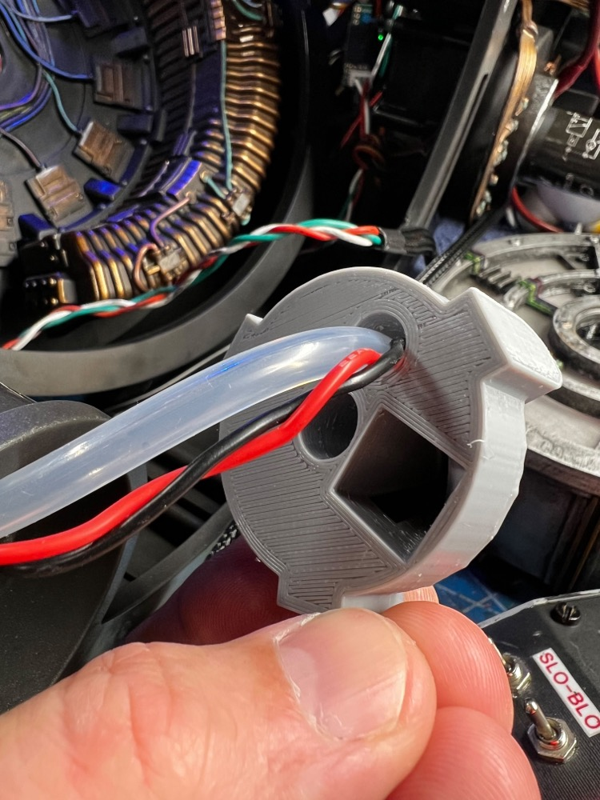

The LED and wires should be installed first, pushing the LED to the very tip of the cone. Once in place, the silicone tubing can be inserted 2-3cm (1/2") into the same hole to keep the wires (and LED) in place. Adding some hot glue will keep these in place and prevent smoke from escaping out this hole in the cone. Once those are installed the tubing and wires can be gently pulled through the drilled hole as the cone is pushed into place and secured using the original screw.

## Testing

Congratulations, you are now ready to test your smoke solution! While in the Video Game mode, use the Barrel Wing Button to select the Venting menu option (after all firing mode options). Put the Neutrona Wand into firing state and press the Intensify button to activate the N-Filter smoke option directly. Alternatively, regardless of mode set your wand to level 5 and throw a proton stream (or activate Cross the Streams) and wait for the smoke effects to kick in.

Remember to activate all smoke options for the pack via the EEPROM menu if you previously changed these.

## DIY Smoke Installation Video ##

[DIY Smoke Installation Video](https://www.youtube.com/watch?v=-q3xkb5oHYE) (YouTube)
