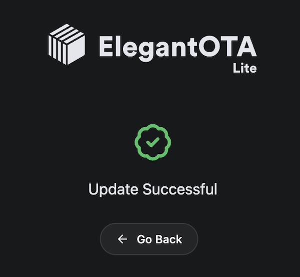

# Stream Effects

What good is a Proton Pack that doesn't throw a stream? This device aims to provide a true interactive experience with your Neutrona Wand by offering a light show of epic proportions, not unlike the spectacle of a giant Twinkie.

This depends on the presence of an Attenuator or WiFi Adapter in order to provide a wireless integration with your equipment.

Watch this demonstration of the Belt Gizmo and Stream Effects devices:
<video src="../videos/effects_demo.webm" controls width="480">
  Your browser does not support the video tag.
</video>

## External Shell

To help make your final device look more polished, a simple project enclosure is available to encapsulate your ESP32 Mini as will be used in this build.

- [ESP32 Mini Enclosure by Dustin Grau](https://www.tinkercad.com/things/39nAaTEvdFY-esp32-mini-enclosure?sharecode=MeckPb0Cxp0IQtvAr5UArlMZEFwcrhd_EKvVeLHaFFM)

## Bill of Materials

Assembly of this device WILL require SOLDERING skills and is considered a DIY approach at this time. The exact list of parts below were chosen for their availability from common sources and/or available support across the Internet.

* [ESP32 Mini Dev Board](https://a.co/d/dMZEs5r)
* [5M Round Reticulate RGB LED Rope Light](https://a.co/d/j8L33dh) [May be found cheaper from AliExpress]
* [270 ohm Resisitor](https://a.co/d/j5Otzhq)

## ESP32 - Pin Connections


The following is a diagram of the **ESP32-Mini pins** from left and right, when oriented with the USB connection facing down (south) AND from the underside, like the pinout diagram above-left. Note that this device has 2 rows of pins so it is best to orient to the view which has the silkscreened labels.

    !! IMPORTANT !!
    This diagram is based on the dev module recommended in the links above.
    If your device differs there will likely be position or label changes.

| Connection | ESP32 (R) |     | ESP32 (L) | Connection |
|------------|-----------|-----|-----------|------------|
| GND LED -  | GND   TXD |     | RST   GND |            |
|            | IO27  RXD |     | SVP    NC |            |
|            | IO25 IO22 |     | IO26  SVN |            |
|            | IO32 IO21 |     | IO18 IO35 |            |
|            | TDI  IO17 |     | IO19 IO33 |            |
| IO4 LEDs   | IO4  IO16 |     | IO23 IO34 |            |
|            | IO0   GND |     | IO5   TMS |            |
| VCC LED +  | IO2   VCC |     | 3.3V   NC |            |
|            | SD1   TD0 |     | TCK   SD2 |            |
|            | CLK   SD0 |     | SD3   CMD |            |
|            |         | **USB** |         |            |

This is a very simple connection scheme. We simply need to power the LEDs from the VCC and any GND ports on the chip, and connect the signal line to the IO4 pin with a 270 ohm resistor inline. This device can be powered by any USB battery bank via a Micro USB cable.

## Assembly

The STL file `stl/stream_effects_enclosure.stl` can be used to enclose the ESP32 while leaving the USB port accessible.

## Firmware Flashing

**Option 1: Using GPStar ESP32 Firmware Uploader**

This uses a purpose-built flash tool just like the tools for the Proton Pack, Neutrona Wand, Single-Shot Blaster and GPStar Audio. Thanks to its ease of use, this is our recommended method for performing the first-time USB upload process. First, download either the Windows or Mac OSX flash tool from the [extras](https://github.com/gpstar81/GPStar-proton-pack/blob/main/extras/) folder. If you are on Linux, try Option 2 below instead.

**Windows:** [GPStar ESP32 Firmware Flasher](https://github.com/gpstar81/GPStar-proton-pack/blob/main/extras/gpstarESP32FirmwareFlasher.exe?raw=1)

**MacOS Intel/M1:** [GPStar ESP32 Firmware Flasher (Mac OSX)](https://github.com/gpstar81/GPStar-proton-pack/blob/main/extras/GPStar-ESP32-Flasher.dmg?raw=1)

1. Plug your device into a USB port on your computer.
2. Locate the following files from the `/binaries/stream` directory.

    * [extras/StreamEffects-Bootloader.bin](https://github.com/gpstar81/GPStar-proton-pack/blob/main/binaries/stream/extras/StreamEffects-Bootloader.bin?raw=1) = This is the standard bootloader for the ESP32 itself.
    * [extras/StreamEffects-Partitions.bin](https://github.com/gpstar81/GPStar-proton-pack/blob/main/binaries/stream/extras/StreamEffects-Partitions.bin?raw=1) = This specifies the partition scheme for the flash memory.
    * [extras/boot_app0.bin](https://github.com/gpstar81/GPStar-proton-pack/blob/main/binaries/stream/extras/boot_app0.bin?raw=1) = This is the software for selecting the available/next OTA partition.
    * [StreamEffects.bin](https://github.com/gpstar81/GPStar-proton-pack/blob/main/binaries/stream/StreamEffects.bin?raw=1) = This is the custom firmware for the GPStar kit.

3. Open the GPStar ESP32 Firmware Flasher and browse to the files specified in step 2 above for each of the four requested file locations (see below screenshot).


4. The program should automatically detect the correct COM port and baud rate (see above screenshot). If it did not, use the drop-down menus to select the correct one for your PC.

5. Click the Upload button to flash the new firmware to your ESP32. Be patient, this process can take between 15 seconds and several minutes depending on the selected baud rate.

6. Once the flash has completed successfully, your ESP32 should now be broadcasting a WiFi network. If the flash failed, please see Solution 2 in the **"[USB Troubleshooting](#usb-troubleshooting)"** section at the bottom of this guide to manually switch the ESP32 into bootloader mode. You may also try lowering the baud rate to 115200 (if available), though note this will increase the time it takes to flash the firmware.

**Option 2: Via Web Uploader**

This uses a 3rd-party website to upload using the Web Serial protocol which is only available on the Google Chrome, Microsoft Edge, and Opera desktop web browsers. Mobile browsers are NOT supported, and you will be prompted with a message if your web browser is not valid for use.

1. Plug your device into a USB port on your computer and go to [http://espwebtool.ghostbusters.engineering](http://espwebtool.ghostbusters.engineering) (which [redirects to https://esp.huhn.me](https://esp.huhn.me)).

1. Locate the following files from the `/binaries/stream` directory.

    * [extras/StreamEffects-Bootloader.bin](https://github.com/gpstar81/GPStar-proton-pack/blob/main/binaries/stream/extras/StreamEffects-Bootloader.bin?raw=1) = This is the standard bootloader for the ESP32 itself.
    * [extras/StreamEffects-Partitions.bin](https://github.com/gpstar81/GPStar-proton-pack/blob/main/binaries/stream/extras/StreamEffects-Partitions.bin?raw=1) = This specifies the partition scheme for the flash memory.
    * [extras/boot_app0.bin](https://github.com/gpstar81/GPStar-proton-pack/blob/main/binaries/stream/extras/boot_app0.bin?raw=1) = This is the software for selecting the available/next OTA partition.
    * [StreamEffects.bin](https://github.com/gpstar81/GPStar-proton-pack/blob/main/binaries/stream/StreamEffects.bin?raw=1) = This is the custom firmware for the GPStar kit.

1. Click on the **CONNECT** button and select your USB serial device from the list of options and click on "Connect".

1. Once connected, select the files (noted above) for the following address spaces:

    * `0x1000` &rarr; [StreamEffects-Bootloader.bin](https://github.com/gpstar81/GPStar-proton-pack/blob/main/binaries/stream/extras/StreamEffects-Bootloader.bin?raw=1)
    * `0x8000` &rarr; [StreamEffects-Partitions.bin](https://github.com/gpstar81/GPStar-proton-pack/blob/main/binaries/stream/extras/StreamEffects-Partitions.bin?raw=1)
    * `0xE000` &rarr; [boot_app0.bin](https://github.com/gpstar81/GPStar-proton-pack/blob/main/binaries/stream/extras/boot_app0.bin?raw=1)
    * `0x10000` &rarr; [StreamEffects.bin](https://github.com/gpstar81/GPStar-proton-pack/blob/main/binaries/stream/StreamEffects.bin?raw=1)

1. Click on the **PROGRAM** button to begin flashing. View the "Output" window to view progress of the flashing operation.

1. Once the device has completely flashed (100%) unplug the USB cable and remove any remaining power source from the device. Restore power to reboot the device and confirm operation.

View [a quick video](images/ESP_Firmware_Update.mp4) of what this process should look like. Your list of USB devices may differ, and it may require selecting a different device if you cannot immediately determine which connected device is your ESP32.

**Option 3: Via Command-Line**

You will need to utilize a command-line tool to upload the firmware to your device from your local computer. Note this is *not recommended* unless you are using a platform other than Windows or Mac OSX, such as Linux.

1. Install the latest Python 3.x utility based on your operating system:

    -  Windows: Download the installer from [Python](https://www.python.org/downloads/windows/). When installing you may be prompted to "Add Python to PATH", and it is recommended to accept that option.
    -  Linux: Execute `sudo apt update && sudo apt install -y python3 python3-pip`
    -  MacOS: Execute `brew install python` using Homebrew ([instructions here](https://brew.sh/))

1. From a terminal (command line) prompt run the following which will install the `pip` tool along with the `esptool` utility:

    ```
    python3 -m ensurepip
    python3 -m pip install --upgrade pip setuptools esptool
    ```

1. Confirm that python was installed successfully by running the commands `python --version` and `python3 --version`. Use the command that reports a 3.x version (`python` or `python3`) for all following steps. We will assume `python3` is available.

1. Navigate to the `binaries/stream` directory within the extracted GPStar-proton-pack software release:

    `cd <extracted_location>/binaries/stream`

1. Run the following command to flash the bootloader and firmware:

    ```
    python3 -m esptool --port-filter vid=0x303A --chip esp32 --baud 921600 write-flash --flash-mode dio --flash-size detect --flash-freq 40m 0x1000 extras/StreamEffects-Bootloader.bin 0x8000 extras/StreamEffects-Partitions.bin 0xe000 extras/boot_app0.bin 0x10000 StreamEffects.bin
    ```

📝 **NOTE:** If your device still cannot be found automatically you may need to view the **"[USB Troubleshooting](#usb-troubleshooting)"** section at the bottom of this guide.

### ESP32: Standard Updates (via WiFi)

This applies to all updates you will perform AFTER the first-time upload of the firmware for the device, when the private WiFi network for the Proton Pack is available via the custom firmware.

1. Power up your Proton Pack and ESP32 device (whether standalone or as part of the Stream Effects hardware).
1. Open the WiFi preferences on your computer/device and look for the SSID which matches **"GPStar_StreamEffects"** or begins **"ProtonPack_"**.
    * If this is your first connection to this access point, use the default password **"555-2368"**.
1. Navigate directly to the URL: [http://192.168.1.2/update](http://192.168.1.2/update)
1. Use the "Select File" button and select the [StreamEffects.bin](https://github.com/gpstar81/GPStar-proton-pack/blob/main/binaries/stream/StreamEffects.bin?raw=1) file from the `/binaries/stream` directory.
1. The upload will begin immediately. Once at 100% the device will reboot.
1. Navigate to [http://192.168.1.2](http://192.168.1.2) or `http://StreamEffects_####.local` to confirm that the device is able to communicate with the Proton Pack PCB.




**Note:** If the upload fails, this is not uncommon. Simply attempt the upload again using the OTA updater.

## Operation

Look for a WiFi network of "StreamEffects_0000" or similar and connect using the password `555-2368`. Open a web browser to the same name as the network name, for instance `http://StreamEffects_0000.local`.

**Security Notice**

This device uses a default password of `555-2368` and should be changed immediately. You also have the option of changing the SSID broadcast if desired.

## USB Troubleshooting

Before beginning any actions when using a USB cable, be sure to use a high-quality USB cable which supports data transfer. Some cheap cables may only support charging (not data), or not fully support the power requirements of the device.

**Problem 1:** Your ESP32 controller does not appear as a serial device in your operating system (COM# for Windows, /dev/cu.usb* for macOS/Linux).

**Solution 1:** It is necessary to install a driver for the **"CP210x USB to UART Bridge"** onto your computer for some devices. A driver for Windows and macOS is available [via Silicon Labs](https://www.silabs.com/developers/usb-to-uart-bridge-vcp-drivers?tab=downloads) and has proved useful.

**Problem 2:** The ESP32 device can be detected when using the [ESPWebTool website](https://esp.huhn.me/) but can't connect. Alternatively, you get a notice that the device must be reset.

**Solution 2:** You must put the device into bootloader mode. To help with this, use the [SerialTerminal website](https://serial.huhn.me/) to connect to your device first:

1. Plug ESP32 into computer
2. Hold down BOOT button
3. While holding BOOT, click EN once
4. Continue holding BOOT until the firmware update tool says "Connecting..." then release

You should see a message similar to the following which indicates the device is ready to flash:

```
rst:0x1 (POWERON_RESET),boot:0x3 (DOWNLOAD_BOOT(UART0/UART1/SDIO_REI_REO_V2))
waiting for download
```

Without disconnecting the device from your computer, and using the **same** browser tab, return to the ESPWebTool website](https://esp.huhn.me/) and complete the flashing process as described earlier in this guide as "Option 2".

**Note:** If you get garbage on the screen when using the serial terminal, use the gear icon at the top right to make sure the baud rate is set to 115200.

**Problem 3:** The process described in Solution 2 did not work, help!

**Solution 3:** Try using Option 1 instead. For users not on Windows or Mac OSX, use Option 3 to run `esptool` manually.

**Problem 4:** For Linux users, if you get a "Permission denied" error when running `esptool` you may need to add your user to the dialout group.

**Solution 4:** Run this command, then log out and back in for the changes to take effect:

    `sudo usermod -aG dialout $USER`

📝 **Tip:** If you have successfully flashed your ESP32 device and do not see the available WiFi access point, try plugging your USB cable directly into the Talentcell battery or try another USB port on your computer. In rare cases the USB port and/or cable cannot supply enough voltage to run the ESP32's WiFi radio.

📝 **Tip:** To identify the USB device requires different methods based on the operating system used:

- For **Linux** use the `lsusb` utility (or `lsusb -v`) to list attached USB devices.
- For **MacOS** run `ls /dev/{tty,cu}.*` to list available USB devices.
- For **Windows**, use the "Device Manager" and look at the **"Ports (COM & LPT)"** section.

These guides from Espressif may be of some help as a reference:

* [Espressif - esptool Installation](https://docs.espressif.com/projects/esptool/en/latest/esp32/installation.html)
* [Espressif - Flashing Firmware](https://docs.espressif.com/projects/esptool/en/latest/esp32/esptool/flashing-firmware.html)
* [Espressif - Boot Mode Selection](https://docs.espressif.com/projects/esptool/en/latest/esp32/advanced-topics/boot-mode-selection.html)

---

## Software Development Requirements

As of the v6.0.0 release the development platform of choice for this device has been migrated from Arduino IDE to the [VSCode with PlatformIO](VSCODE.md). Please follow the linked guide for installing the core software and plugins required.