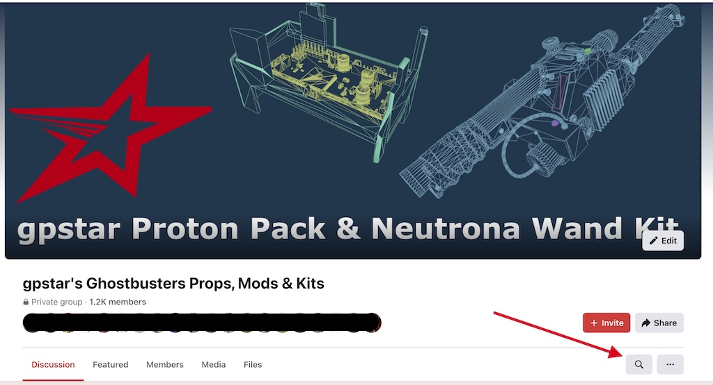
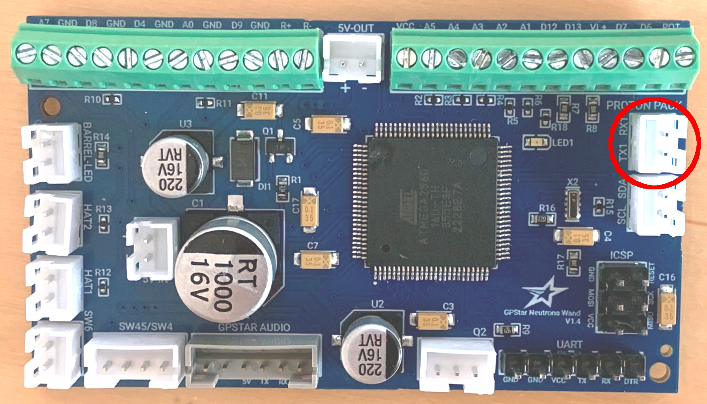
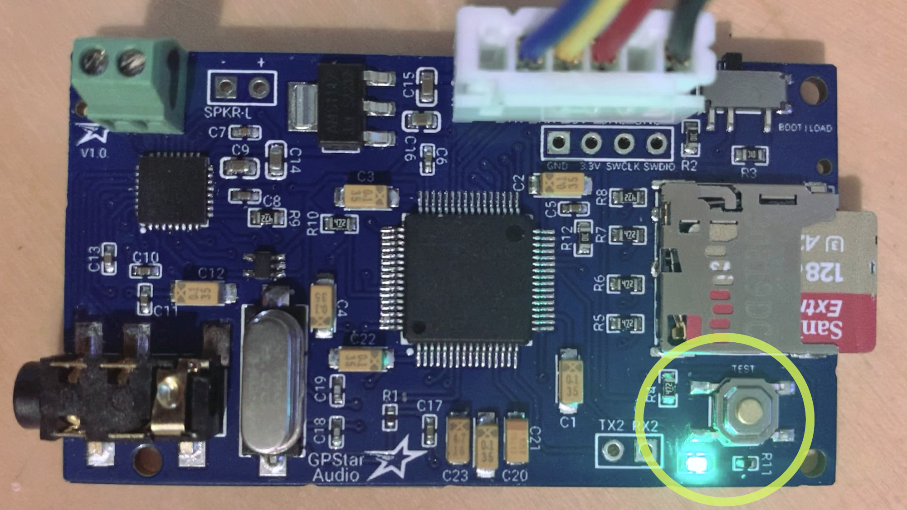

# Troubleshooting #

If you are experiencing issues during the installation process there are a few ways to get back on track. Use the guides below to help narrow down where you are having an issue and try the suggested remedies. Should you need additional assistance, reach out to the [GPStar Technologies Facebook group](https://www.facebook.com/groups/gpstartechnologies) and either use the group search (see below) or post a question to the community.

### General Guidance ###

Before continuing, be certain whether the following items have been reviewed:

- Check he operation switch on your audio controller:
	- GPStar Audio should be set to BOOT.
	- WAV Trigger should be set to RUN.
- Check that the microSD card is fully seated (pushed) into its socket.
- Check the JST connector on the PCB controller is fully seated into its socket.
- Verify the connections are intact and solid for GND, 5Vin, Rx, and Tx in all parts of the hose connectors.
- Sound files should start with a file having a prefix of `001_` and increment by 1.
- Music files should start with a file having a prefix of `500_` and increment by 1.
- Switch to SanDisk brand media as these SD cards have proven reliable in every use case.

## IMPORTANT ##

When adding extra music to your system, many audio software tend to add Meta Data information into the file. This will prevent the file from playing. As simple as importing the file into Audacity and re-exporting will solve the issue, or you can use any other software to remove the Meta Data information.

## Proton Pack ##

Since all connections to the Proton Pack utilize standard JST-XH connections to the available devices, please re-check any connections for incorrect seating and polarity before continuing. If these are in place then at a minimum you should be able to turn on the pack using the red switch under the ion arm which should cause the Powercell lights to activate. This will be the primary means of validating that the pack controller is enabled.

### Pack will not power on (no lights or sounds) ###

Confirm that the battery pack is sufficiently charged, switched to the on state, and USB-to-JST connection is in place.

### Pack Cyclotron (lid) will not light up ###

Always be sure that your Power Cell device is plugged in and working, first. Both the Power Cell and Cyclotron are considered to be a single, continuious chain of LEDs and the latter will not function without the former. Note that when you first apply power to your pack you should hear and see a startup sequence which is a form of sanity check on the hardware to confirm the lights are working as expected.

If using the Cyclotron Bypass (for Spirit or DIY packs) you must ensure the jumper is in place on the board to simulate the lid closure state. Removing or replacing the jumper while power is applied should result in an audio cue to indicate the bypass device is working (simulating lid removal and replacement).

### Pack has lights but does not play audio ###

* Re-check the 3.5mm audio cable is connected to the audio amplifier, and that the audio amplifier has power, is connected to at least 1 speaker, and volume has been turned up to at least 30%.
* If possible, connect the 3.5mm audio cable to a known-good audio source such as a smartphone, Alexa device, or similar to confirm that the amplifier is capable of receiving a signal.

If there is still no sound from your Proton Pack, please refer to the Audio Troubleshooting section at the bottom of this page.

## Neutrona Wand ##

The wand assumes successful operation of the pack, so please only proceed once that has been established.

### Wand will not power on (no lights or sounds) ###

The wand is expects to communicate with the pack and will only power on when that connection is successfully established. If no lights or audio are observed when using the Activate switch, please consider the following options.

* Re-check the Power/GND connections in the hose to make sure they are not reversed. Also check if the ends of the wires are making contact on the Neutrik connectors when clamping down. You can tin the ends of the wires to make it a bit thicker or simply fold them over to double them up. Just make sure the Neutrik connectors are not clamping down on the rubber part of the wire.
* If you are using the 28 Segment bargraph from Frutto Technology, make sure the connection cables are plugged into the proper connectors. If the power cable for the bargraph is plugged into the SCL/SDA connector on the wand board and the communication cable is plugged into the 5V power connector on the wand board, then the wand will not start up.

### Wand has a blinking vent light but does not start up ###

When the wand is trying to establish communication to the GPStar Proton Pack controller, the LED beside the vent light blinks. When a successful connection is made, the light will stop blinking.

* Re-check the TX/RX serial connections in the hose to make sure they are not reversed. Also check if the ends of the wires are making contact on the Neutrik connectors when clamping down. You can tin the ends of the wires to make it a bit thicker or simply fold them over to double them up. Just make sure the Neutrik connectors are not clamping down on the rubber part of the wire.
* (Firmware 5.3.3 or later) You can test to see if your issue is related to the serial data lines for the hose connectors by shorting the wand board's pack data connector TX and RX pins. This will cause the wand to start in standalone mode and ignore the Proton Pack.

### Wand has no audio ###

* Re-check the connection to the speaker. Polarity should be observed for the best audio quality, though a reversed connection should still support some form of audio playback.
* Re-flash the latest software to both the pack and wand controllers. These devices must be in agreement for the communication layer to operate correctly.
* Re-check the Tx/Rx connections to the pack. If these are reversed it will prevent proper communication. Attempt to switch the wires at the pack-side connector which use screw terminals, and retry the Activate switch.
* Re-check the power connection to the wand. If you have a digital multimeter available, set the device to the DC power measurement and check that the 5V-OUT connection is supplying the expected voltage. Be careful to not short out the pins and mind the polarity.

### Wand has audio briefly before it cuts out ###

* Re-check the connection to the speaker terminal blocks on the Audio board. Make sure the wires seat well, if needed, add a dab of solder onto the ends.

If there is still no sound from your Neutrona Wand, please refer to the Audio Troubleshooting section at the bottom of this page.

### The music I added is not playing back ###

* Make sure to following the naming conventions that are indicated in the [Loading The Audio Files](AUDIO.md) guide.
* Remove any metadata that may be embedded in your wav files. This can cause problems with loading the music.
* The Proton Pack at a minimum must contain all the music, however it is advised for the Neutrona Wand to have the same files as well if you want music to also play back from the Neutrona Wand audio system while the Neutrona Wand is operating in Bench Test Mode.

### I'm firing but no overheating is happening! ###

If your pack and wand are on default settings (you may test this by entering the EEPROM Configuration Menu then pressing Intensify to clear all settings, then turn off the Talentcell battery so the changes take effect), only Power Level 5 will overheat, and will do so after 30 seconds. If you have made changes to EEPROM settings, here are common reasons why overheating may not occur as expected.

* If you are in Cross The Streams or Cross The Streams Mix instead of Video Game Modes, overheating will only occur when using the alternate fire button (Barrel Wing Button). No overheating will occur if you hold Intensify by itself.
* Check to make sure you have the global Overheating setting enabled. If this is disabled, no overheating will ever occur.
* Check to make sure that the overheating toggle for the specific power level you are in is also enabled (enabling overheating generally will not automatically enable it for all power levels).
* Check to see what you have the Overheat Start Delay for the specific power level you are in set to. For example, merely enabling overheating for Power Level 1 will mean it will take 60 full seconds before overheating triggers by default.

### Bench Test Mode ###

If you wish to use the Neutrona Wand without a Proton Pack, flash [NeutronaWand-BenchTest.hex](https://github.com/gpstar81/GPStar-proton-pack/blob/main/binaries/wand/extras/NeutronaWand-BenchTest.hex?raw=1) from the Neutrona Wand binary extras folder to the device to enable a special mode which will allow the wand to operate without waiting for a response from the pack. As of firmware 5.3.3 you can also bridge/jumper the Proton Pack TX1 and RX1 pins on the Neutrona Wand circuit board to enable Bench Test mode without flashing the above firmware (see below image). This is useful for debugging whether an issue with your Proton Pack serial connection is the cause of your wand issues.

## Audio Troubleshooting ##

Depending on which audio board or amplifier you are using in your system, following the troubleshooting guides below.

---

### GPStar Amplifier Troubleshooting ###

If no audio is heard but the green LED is lit, make sure that 2 jumpers are attached on the 6 pin JST connector near the center of the board. This connector is reserved for use with a 250k stereo potentiometer but must be configured to allow audio to pass when one is not in use. The following table shows the 2 pairs of pins which must be jumpered for operation.

| R-I | R-O | GND | L-I | L-O | GND |
|-----|-----|-----|-----|-----|-----|
|  X  |  X  |     |  X  |  X  |     |

Remember that a ground loop isolator is not required for this device as this is built into the hardware. Use of an additional isolator may negatively impact the audio quality.

---

### GPStar Audio Troubleshooting ###

**Troubleshooting**

1. Make sure your WAV files are named properly and are located in the root directory of the microSD card. When you first power on GPStar Audio, it will locate and index the files and then the green LED will blink at half second intervals. **NOTE:** As of firmware 5.4.4, once the GPStar Audio successfully connects to one of the device boards the green LED will turn off to prevent light bleed.

2. If there’s no activity on the green status LED whatsoever when you first power up the GPStar Audio, check the “BOOT/LOAD” switch next to the 6 pin JST-XH connector is in the “BOOT” position.

3. Once you see the green status LED blinking slowly, pressing the on-board "Test" button will play the lowest numbered track on the microSD card. Confirm this by observing the green status LED turning blinking very rapidly to indicate a track is playing. You should hear the track through the stereo jack or any speaker connected to the board. **NOTE:** As of firmware 5.4.4, this LED will not blink if the GPStar Audio has successfully connected to GPStar equipment. The GPStar Audio can be tested outside of equipment by plugging your GPStar Programming Cable into the white device connector and connecting the USB cable to your computer.

4. Low quality SD Cards sometimes provide issues such as sounds not playing. Please consider using high quality SD Cards. We recommend the Sandisk Extreme A1/A2 U3 V30 32GB Micro SD Cards.

5. If you’ve gotten this far and tracks won’t play, then it’s most likely that your WAV files are not the correct format. GPStar Audio will only play uncompressed WAV files formatted as 16-bit, stereo, 44.1kHz, and there can be no meta-data (non-audio data) in the file before the audio data. It seems that many Mac audio applications insert a meta-data chunk prior to the audio, and this will prevent the track from playing. In such cases, simply importing the file and re-exporting with Audacity will likely fix the problem.

6. Please remove any metadata contained in the music wav files you add, as it can cause issues loading the file for playback.

---

### WAV Trigger Troubleshooting ###

**Startup Blinking Patterns:**

- 1x (long) - 1 long blink upon startup indicates that the SD card is no good or the formatting was bad. Re-format fully using your OS or the provided [guiformat.exe](https://github.com/gpstar81/GPStar-proton-pack/blob/main/extras/sound/guiformat.exe?raw=1) utility in [extras](https://github.com/gpstar81/GPStar-proton-pack/blob/main/extras/) (for Windows only). Name brand microSD cards are highly recommended, with SanDisk having been proven the most reliable so far.
- 3x (quick) - 3 quick blinks in succession is the normal pattern at initial power-up to indicate the device has initialized without issues.

**Post Startup Blinking Patterns**

- 1x - The WAV Trigger will blink once every ~4 seconds when the PCB and device are powered on. This indicates a regular serial connection checking the status of the WAV Trigger and is to be expected.

**Troubleshooting**

1. Make sure your WAV files are named properly and are located in the root directory of the microSD card. When you first power on the WAV Trigger, it will locate and index the files and then blink 3 times to indicate that it found at least one WAV file. One long blink means that it either couldn’t read the card or it didn’t find any WAV files.

1. If there’s no activity on the "Red" status LED whatsoever when you power up the WAV Trigger, check the “Load/Run” switch next to the power connector and make sure it’s in the “Run” position.

1. Once you get the 3 blinks, pressing the on-board button will play the lowest numbered track on the microSD card. Confirm this by observing the status LED turning on to indicate a track is playing. You should hear the track through the stereo jack. If the audio is not working, try plugging in a set of headphones into the 3.5mm audio port and test again. If you’re using the on-board audio amp and speaker connection, you won’t hear anything unless the onboard amp is enabled using the init file or via software.

1. Low quality SD Cards sometimes provide issues such as sounds not playing. Please consider using high quality SD Cards. We recommend the Sandisk Extreme A1/A2 U3 V30 32GB Micro SD Cards.

1. If you’ve gotten this far and tracks won’t play, then it’s most likely that your WAV files are not the correct format. The WAV Trigger will only play WAV files formatted as 16-bit, stereo, 44.1kHz, and there can be no meta-data (non-audio data) in the file before the audio data. It seems that many Mac audio applications insert a meta-data chunk prior to the audio, and this will prevent the track from playing. In such cases, simply importing the file and re-exporting with Audacity will likely fix the problem.

1. Please remove any metadata contained in the music wav files you add, as it can cause issues loading the file for playback.

[Manual for the WAV Trigger [pdf]](https://github.com/gpstar81/GPStar-proton-pack/blob/main/extras/sound/WavTrigger/WT_UserGuide_20230602.pdf?raw=1)
