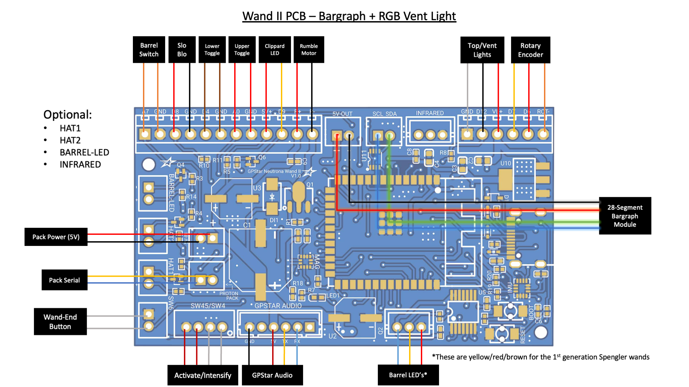
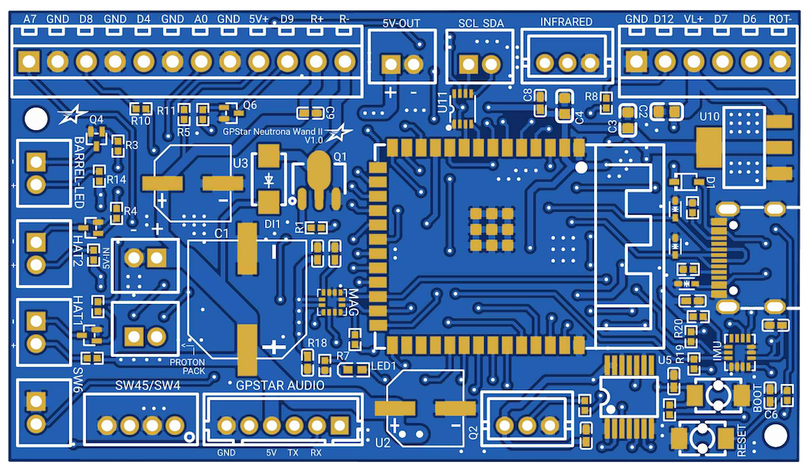

<h1> GPStar Wand || PCB Hookup</h1>

&starf; For a comparison of the original GPStar and GPStar II controllers please see [this comparison guide](https://gpstartechnologies.com/blogs/gpstar-blog/gpstar-ii-vs-gpstar) on the main GPStar website.

Welcome to the second generation of GPStar Proton Wand controllers, intended for users who wish to fully replace the stock lighting of their Haslab Neutrona Wand or are building a DIY wand. This device improves on several core feature changes based on real-world use and customer requests.

**Significant Features/Changes:**

- Processor change to ESP32-S3 SoC instead of ATMega2560, offering dual CPU cores operating at a faster clock speed.
- Integrates a WiFi radio for direct web-enabled controls and firmware updates.
- Features a 6-axis gyroscope and acceleration sensor for motion response.
- Dedicated sockets for optional components and future expansion.
    - An infrared LED add-on will be coming in the future to support integration with the Ghost Trap.

**Other Hardware Changes:**

- Programming pins were replaced with a USB-C connector for direct connectivity to your computer for firmware updates.
- Support for the stock Vent/Top lights has been deprecated for the addressable GPStar RGB LED vent light device instead.
- Support for the stock 5-LED bargraph has been deprecated in favor of a true multi-segment bargraph.
    - Only i2c bus modules are supported (either Frutto Technology or GPStar bargraph devices).
    - Older "2.0" Frutto bargraph units are NOT COMPATIBLE and must be upgraded to 3.0 or higher. GPStar bargraph units are already fully compatible.

**IMPORTANT: The GPStar Wand II controller is NOT backwards compatible with the original GPStar Pack controller! DO NOT attempt to mix and match wands as you can potentially damage your devices.**

This guide is part of the kit approach to providing a minimally-invasive upgrade to the stock HasLab controllers. For the Neutrona Wand all available connections for JST-PH wiring is present, though a significant amount of wire-cutting will be required to separate the stock controller and re-attach using terminal blocks on the new PCB.

This device drops support for the 5-LED bargraph offered as part of the stock wand configuration and instead requires the use of a 28-segment or 30-segment bargraph. Additionally, support for the stock 2-LED top/vent light assembly is replaced by a single wire for the RGB LED vent light.

## Neutrona Wand - Connection Details

Connections for the wand should be made according to the tables below.

- Ordering aligns with PCB labels or when viewed left-to-right with the connector keyhole at the bottom.
- Pins denoted A#/D# correspond to the internal code and connection to the controller chip.
- Ground may be designated as "GND" or simply "-".

### Stock Connectors (JST-PH)

| Label | Pins | Notes |
|-------|------|-------|
| 5V-IN | +/\- | 2-pin JST-PH for power from Proton Pack. **This MUST be a regulated 5V source!** |
| Q2 | VCC/D10/GND | 3-pin JST-PH connection for addressable barrel LEDs |
| SW45/SW4 | GND/D2/GND/D3 | 4-pin JST-PH connection for the Intensify button and Activate toggle |
| SW6 | GND/A6 | 2-pin JST-PH connection for the orange wand-end mode/alt switch |

**Note:** The 3-pin connector for the Barrel LEDs is compatible with the [GPStar 50-LED Neutrona Barrel](https://gpstartechnologies.com/products/gpstar-neutrona-barrel) or the [GPStar Barrel LED Mini](https://gpstartechnologies.com/products/gpstar-barrel-led-mini).

### Stock Connectors (Terminal Blocks)

| Label/Pin | Color | Notes |
|-----------|-------|-------|
| A7 | Orange | Barrel extension switch (wire order does not matter) |
| GND | Orange | Barrel extension switch (wire order does not matter) |
| D8 | Red | Slo-Blo VCC |
| GND | Black | Slo-Blo GND |
| D4 | Brown | Lower-right Toggle (wire order does not matter) |
| GND | Brown | Lower-right Toggle (wire order does not matter) |
| A0 | Red | Upper-right Toggle (wire order does not matter) |
| GND | Red | Upper-right Toggle (wire order does not matter) |
| 5V+ | Red | Clippard LED (Top Left) VCC |
| D9 | Yellow | Clippard LED (Top Left) GND |
| R+ | Red | Rumble (vibration) motor VCC |
| R- | Black | Rumble (vibration) motor GND |
| GND | Black | Ground for RGB vent light |
| D12 | White | RGB vent light data |
| VL+ | Red | VCC for RGB vent light |
| D7 | Orange | Rotary encoder B |
| D6 | Red | Rotary encoder A |
| ROT- | Brown | Ground for rotary encoder |

### Special Connectors

| Label | Pins | Notes |
|-------|------|-------|
| PACK (Serial) | TX1/RX1 | Serial communication to the Proton Pack. **IMPORTANT: The GPStar Wand II controller is NOT backwards compatible with the original GPStar Pack controller! DO NOT attempt to mix and match wands as you can potentially damage your devices.**  `Connector type: JST-PH` |
| AUDIO BOARD | GND/NC/VCC/TX/RX/NC | Communication and Power for the wands's GPStar Audio or WAV Trigger.  `Connector type: JST-PH` |
| USB-C | Socket | This controller now comes with a standard USB-C socket for programming, though it is now possible to update using over-the-air (OTA) process via the WiFi and web interface |

### Optional Connectors

| Label | Pins | Notes |
|-------|------|-------|
| HAT1 | GND/D22 | Connection for top of the barrel tip hat LED.  The left (top in the photo) pin is GND, the right (bottom in the photo) pin is D22 which provides 5V and has a 150Ω resistor connected to it.  `Connector type: JST-PH`  `Do not draw more than 40mA from this connector.` |
| HAT2 | GND/D23 | Connection for the wand box hat LED.  The left (top in the photo) pin is GND, the right (bottom in the photo) pin is D23 provides 5V and has a 150Ω resistor connected to it.  `Connector type: JST-PH`  `Do not draw more than 40mA from this connector.`|
| BARREL-LED | GND/D24 | Connection for white wand tip light.  The left (top in the photo) pin is GND, the right (bottom in the photo) pin is D24 which provides 5V and has a 100Ω resistor connected to it.  `Connector type: JST-PH`  `Do not draw more than 40mA from this connector.` |
| 5V-OUT | +/\- | Power for additional accessories, intended for the 28-segment or 30-segment bargraph.  `Connector type: JST-PH` |
| SCL/SDA | SCL/SDA | Expansion serial port using I2C, intended for the 28-segment or 30-segment bargraph.  `Connector type: JST-PH`|
| INFRARED | 5V/D17/GND | Dedicated port for an infrared LED circuit (port outputs 5V with a signal line).  `Connector type: JST-PH`|

### Hardware Calibration

In order to get accurate readings from your wand's magnetometer you must first perform magnetic calibration based on your specific installation and hardware. This means the calibration must be performed AFTER the controller has been fully installed with the speaker and any other accessories within your wand. Please see the [Wand Calibration Guide](WAND_CALIBRATION.md) for more information.
