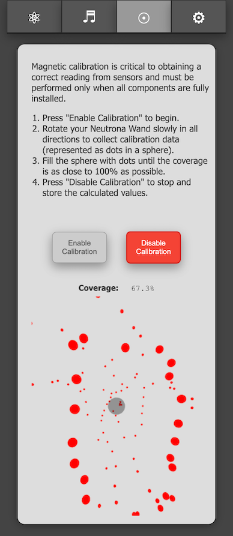

<h1> GPStar Neutrona Wand II  Magnetic Calibration</h1>

The GPStar Neturona Wand II is equipped with a gyroscope and magnetometer. The sensors can be even more finely calibrated to provide more accurate data after it is fully installed into your Neutrona Wand, taking into account nearby magnetic sources such as a speaker.

To begin, connect to the WiFi on the GPStar Neutrona Wand II, enabling first via the [Operational Menu](OPERATION_MENUS.md) `Level 3 -> Option 5 -> Intensify`.

## Starting Calibration

Once connected to the Neutrona Wand via WiFi and accessing the web UI, click on the Calibration Menu icon at the top. To begin the data collection process click on the `Enable Calibration` button.

The system will now will ask you to rotate your Neutrona Wand slowly in all directions. A visual calibration monitor will appear on screen to show your progress. Rotate your Neutrona Wand slowly to fill it with dots until the coverage is as close as possible to 100%.

## Stopping Calibration

When you are satisfied with the results or the coverage value no longer changes, click on the `Disable Calibration` button to save the newly calibrated settings into the system memory.

**Note:** You must have at least 60% coverage in order for the calibration data to be effective! If you exit the calibration process before reaching 60% you will be given a confirmation to either continue collecting data or stop the process and no calibration values will be calculated.

## Verifying Calibration

Click on the Settings tab at the top of the UI and go to the "Special Device Settings" page. On this screen you should see magnetic offset information which display "Hard Iron" (geo-magnetic corrections) and "Soft Iron" (nearby magnetic interference). These values will be used to provide a customized magnetic profile explicitly for your Neutrona Wand.

