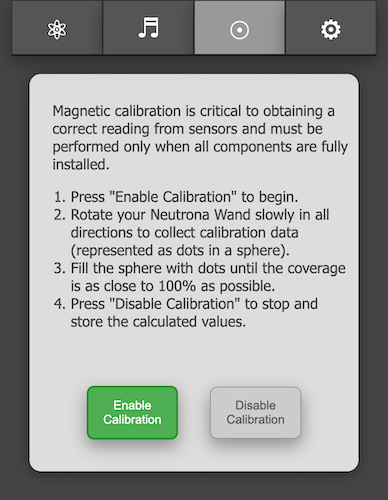

<h1> GPStar Neutrona Wand II Calibration</h1>

The GPStar Neturona Wand II is equipped with a gyroscope/accelerometer (IMU) and magnetometer. These sensors can be finely calibrated to provide more accurate data after it is fully installed into your GPStar Neutrona Wand II (or GPStar Single Shot Blaster II), taking into account nearby magnetic sources such as a speaker.

To begin, connect to the WiFi on the GPStar Neutrona Wand II, enabling first via the [Operational Menu](OPERATION_MENUS.md) `Level 3 -> Option 5 -> Intensify`.

## Calibration Options

Once connected to the Neutrona Wand via WiFi and accessing the web UI, click on the Calibration Menu icon at the top (a circle with a center dot). You will have a choice of calibrating either the gyroscope or magnetometer. Full instructions can be seen by clicking/touching the collapsed header which will expand a larger section of text explaining the process.

## Before You Begin

Click on the Settings tab at the top of the UI and go to the "Special Device Settings" page. Available in this section is the **Controller Installation Orientation** selection. This sets the intended installation of the sensors which is crucial for identifying the X, Y, and Z axes for spatial orientation. For example, on Hasbro Neutrona Wands, it will be "Components Down, USB Front". For a Mack's Factory Neutrona Wand, it will be in a different orientation such as "Components Left, USB Front". Please note that changing the orientation will reset the magnetic offset values and re-calibration will be required.

**This option MUST be correctly selected and saved BEFORE starting any calibration processes!**

## Gyroscope Calibration

Calibration of the gyroscope is very much a hands-off approach and quite simple. The device should be laid flat on a solid surface, rightside-up, and as level as possible. Press the `Gyro Calibration` button to begin the process which will run for 30 seconds. A countdown timer will report the time remaining and an audible beep will be heard from the device each second as it counts down. Once completed, all data will be automatically stored into the device's memory for immediate use when you pick it up.

## Magnetic Calibration

Calibration of the magnetometer is much more hands-on as it requires you to move the device in the air in multiple directions to fully capture magnetic readings for the X, Y, and Z axes.

### Starting Magnetic Calibration

Press the `Start Calibration` button. The system will now will ask you to rotate your Neutrona Wand relatively slowly in all directions. A visual calibration monitor will appear on screen to show your progress. Rotate your Neutrona Wand slowly to fill it with dots until the Coverage Density is as close as possible to 100%, though anything over 60% will give sufficient results and will be the threshold used when confirming the end of calibration.

**TIP:** Point the Neutrona Wand down, and slowly raise it up in an arc. Turn slightly and then arc back to full down. Repeat this process until you have done a 360. If possible, twist your arm while holding the device or trace figure-eights in the air as you move to more quickly increase the coverage density.

### Stopping Magnetic Calibration

When you are satisfied with the results or the coverage value no longer changes, click on the `Stop Calibration` button. You will be prompted to confirm that you wish to end collection of data and save the newly calibrated settings into the system memory.

**Note:** You must have at least 60% coverage in order for the calibration data to be effective! If you exit the calibration process before reaching 60% you will be given a confirmation to either continue collecting data or stop the process. If below the threshold of 60% no calibration values will be calculated or stored and the system will revert to default values.

### Verifying Magnetic Calibration

On the "Special Device Settings" page as shown at the top of this page, you should see magnetic offset information which displays "Hard Iron" (geo-magnetic corrections) and "Soft Iron" (nearby magnetic interference). These values will reflect the customised magnetic profile explicitly for **your** Neutrona Wand. It is not advised to modify these values by hand, though they remain available for special debugging purposes only.